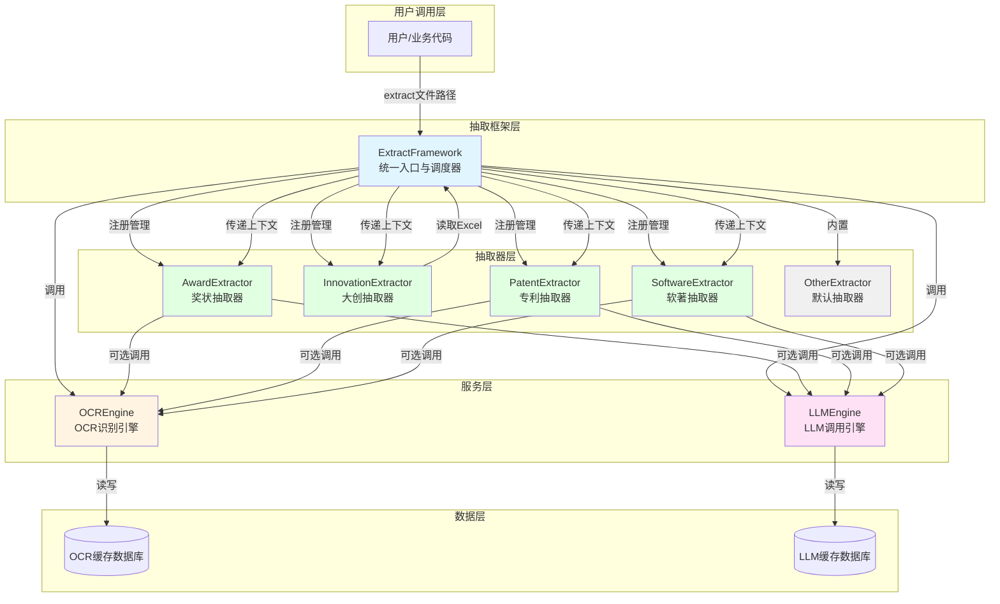
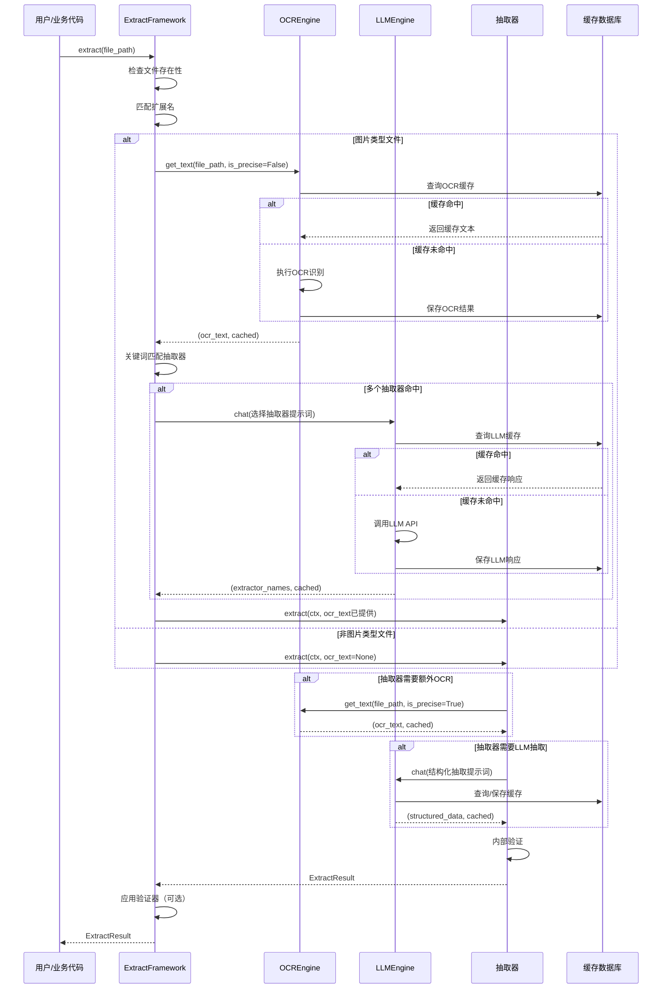
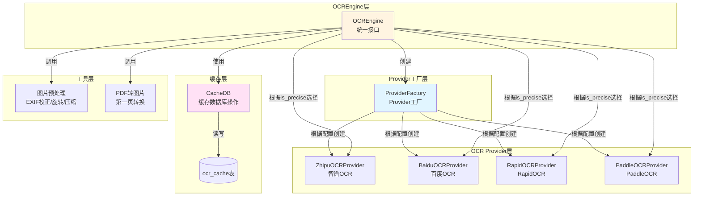
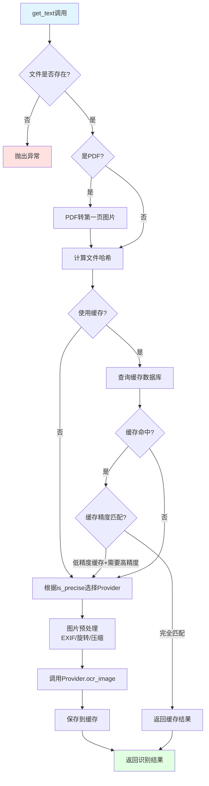
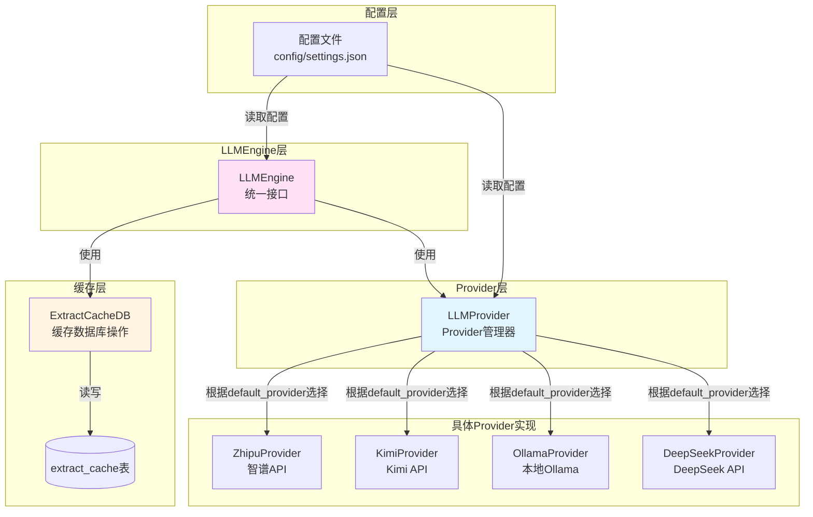
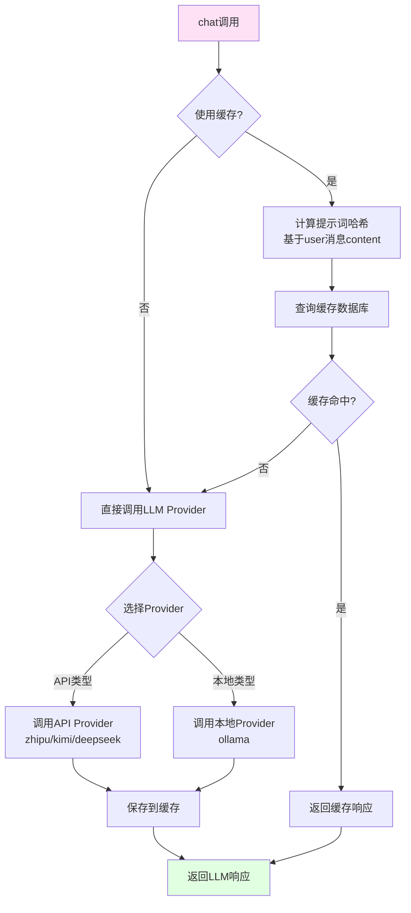
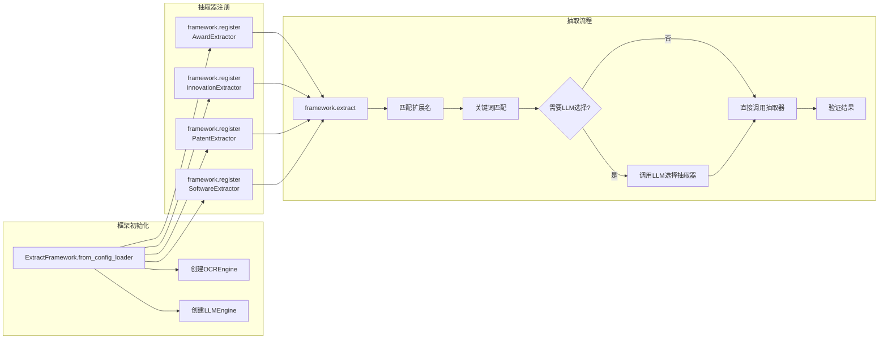
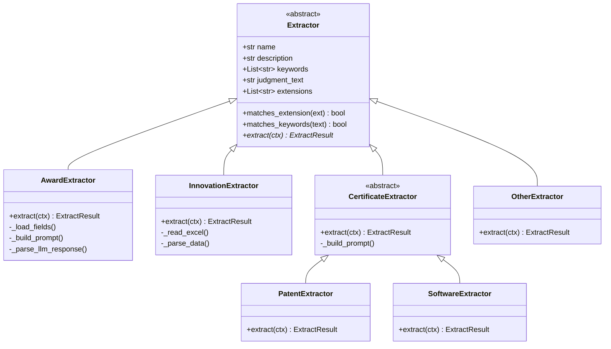

# 抽取模块架构关系图

本文档通过图表清晰展示抽取框架、OCR、各个抽取器、LLM之间的关系，以及OCR和LLM内部的简易关系。

## 一、整体架构关系图

### 1.1 核心组件关系



### 1.2 数据流向图



### 1.3 组件职责说明

| 组件 | 职责 | 关键方法 |
|------|------|---------|
| **ExtractFramework** | 统一入口，管理抽取器注册与调度 | `extract()`, `register()`, `_extract_image()`, `_extract_non_image()` |
| **OCREngine** | 图片/PDF文本识别，支持缓存和精度分级 | `get_text()`, `clear_cache()` |
| **LLMEngine** | LLM调用，支持缓存和多种Provider | `chat()`, `clear_cache()` |
| **AwardExtractor** | 奖状证书结构化抽取 | `extract()` |
| **InnovationExtractor** | Excel大创项目抽取 | `extract()` |
| **PatentExtractor** | 专利证书结构化抽取 | `extract()` |
| **SoftwareExtractor** | 软著证书结构化抽取 | `extract()` |
| **OtherExtractor** | 默认抽取器，处理无法匹配的文件 | `extract()` |

## 二、OCR内部关系图

### 2.1 OCR架构关系



### 2.2 OCR执行流程



### 2.3 OCR精度分级说明

| 精度级别 | 说明 | 适用场景 | Provider示例 |
|---------|------|---------|-------------|
| **高精度** (`is_precise=True`) | 使用大型模型，识别精度高，消耗更多资源 | 最终识别、重要文档 | zhipu, baidu |
| **低精度** (`is_precise=False`) | 使用轻量级模型，速度快，资源消耗低 | 快速筛选、初步识别 | rapid, paddle |

**缓存匹配策略：**
- 高精度缓存 + 需要高精度 → 直接返回缓存 ✅
- 低精度缓存 + 需要低精度 → 直接返回缓存 ✅
- 低精度缓存 + 需要高精度 → 调用高精度OCR并更新缓存 🔄
- 高精度缓存 + 需要低精度 → 直接返回缓存（精度更高可用）✅

## 三、LLM内部关系图

### 3.1 LLM架构关系



### 3.2 LLM执行流程



### 3.3 LLM Provider类型

| Provider类型 | 说明 | 配置字段 | 示例 |
|-------------|------|---------|------|
| **API类型** | 调用远程API服务 | `type: "api"` | zhipu, kimi, deepseek |
| **本地类型** | 调用本地模型服务 | `type: "local"` | ollama |

**缓存机制：**
- 缓存键：基于所有user消息content的SHA256哈希
- 相同提示词 → 相同哈希 → 命中缓存
- 支持独立控制：`use_cache` 参数

## 四、抽取器与框架交互关系

### 4.1 抽取器注册与调用



### 4.2 抽取器基类接口



## 五、关键交互场景

### 5.1 图片文件抽取流程

```
1. 用户调用 framework.extract("award.jpg")
   ↓
2. 框架检查扩展名，匹配到 AwardExtractor
   ↓
3. 判断为图片类型，调用 OCR.get_text("award.jpg", is_precise=False)
   ↓
4. OCR查询缓存，未命中则调用Provider识别，保存缓存
   ↓
5. 框架使用OCR文本进行关键词匹配，命中AwardExtractor
   ↓
6. 框架调用 AwardExtractor.extract(ctx, ocr_text="...")
   ↓
7. AwardExtractor内部：
   - 检查关键词匹配
   - 调用 LLM.chat(结构化抽取提示词)
   - LLM查询缓存，未命中则调用API，保存缓存
   - 解析LLM响应为结构化数据
   - 内部验证
   ↓
8. 返回 ExtractResult
```

### 5.2 Excel文件抽取流程

```
1. 用户调用 framework.extract("innovation.xlsx")
   ↓
2. 框架检查扩展名，匹配到 InnovationExtractor
   ↓
3. 判断为非图片类型，直接调用 InnovationExtractor.extract(ctx, ocr_text=None)
   ↓
4. InnovationExtractor内部：
   - 读取Excel文件
   - 解析列名和数据
   - 内部验证
   ↓
5. 返回 ExtractResult
```

### 5.3 多抽取器竞争场景

```
1. 用户调用 framework.extract("certificate.jpg")
   ↓
2. 框架检查扩展名，匹配到 PatentExtractor 和 SoftwareExtractor
   ↓
3. 判断为图片类型，调用 OCR.get_text()
   ↓
4. 框架使用OCR文本进行关键词匹配，两个抽取器都命中
   ↓
5. 框架调用 LLM.chat(选择抽取器提示词)
   ↓
6. LLM返回 ["patent"]，框架选择 PatentExtractor
   ↓
7. 调用 PatentExtractor.extract(ctx, ocr_text="...")
   ↓
8. 返回 ExtractResult
```

## 六、总结

### 6.1 核心设计原则

1. **统一入口**：ExtractFramework 作为唯一入口，统一管理所有抽取器
2. **服务解耦**：OCR和LLM作为独立服务，通过上下文传递给抽取器
3. **缓存透明**：OCR和LLM的缓存机制对上层完全透明
4. **配置驱动**：所有Provider、精度级别、缓存策略都通过配置控制
5. **可扩展性**：通过注册机制轻松添加新的抽取器

### 6.2 关键数据流

```
文件路径 
  → ExtractFramework 
    → OCREngine (图片类型)
      → OCR文本
        → 关键词匹配
          → LLM选择抽取器 (多命中时)
            → 抽取器.extract()
              → LLMEngine (结构化抽取)
                → ExtractResult
```

### 6.3 性能优化策略

1. **扩展名过滤**：先按扩展名过滤，避免无关类型走OCR/LLM
2. **关键词过滤**：单命中直接派发，不调LLM；仅多命中时才调LLM选择
3. **精度分级**：快速筛选用低精度OCR，最终识别用高精度OCR
4. **缓存机制**：OCR和LLM都支持缓存，减少重复调用
5. **顺序调用**：抽取器按顺序调用，首个非other即返回

---

**文档版本**: 1.0  
**最后更新**: 2026-01-25  
**作者**: Claude Code
