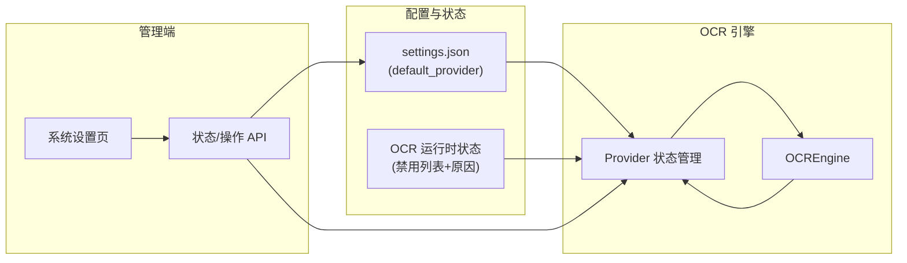

# OCR 供应商故障切换与管理员状态管理

## 一、概述与目标

OCR 模块支持多个高精度供应商（如智谱、百度、Paddle）。当某供应商因限频（429）、超时或费用不足等原因不可用时，系统应：

1. **自动标记该供应商不可用**，并**在同请求内切换到下一个可用高精度供应商**；若全部不可用则回退到低精度（如 RapidOCR）。
2. **不抛异常**：调用方得到文本或空串，并通过 `last_ocr_warning` 或 `ExtractResult.metadata["ocr_warning"]` 获知曾发生回退。
3. **管理员可见**：在系统设置中查看当前实际使用的高精度供应商、各供应商的可用/禁用状态及故障理由。
4. **管理员可操作**：重新启用某供应商（如已充值）、将某供应商设为当前默认。

本文档描述运行时状态存储、高精度链调用逻辑、管理端 API 与界面，以及与 [OCR识别与缓存设计.md](OCR识别与缓存设计.md) 的衔接。

---

## 二、整体架构



- **配置**：`config/settings.json` 提供 `ocr.default_provider`、`ocr.providers`（含 `is_precise`）、`ocr.runtime_status_path`（运行时状态文件路径）。
- **运行时状态**：独立于 settings 的持久化存储，仅记录“哪些供应商被标记为不可用及原因”，供引擎跳过、供管理端展示与操作。
- **OCREngine**：依赖“高精度供应商有序列表 + 运行时状态”，按序尝试（跳过已禁用），失败则写状态并试下一个，全部失败再回退低精度。
- **管理端**：只读状态 + “重新启用”“设为当前”操作；必要时写回 `settings.json`（仅“设为当前”会改 `default_provider`）。

---

## 三、运行时状态存储

**方式**：独立 JSON 文件，路径由配置指定，禁止硬编码。

**配置项**：`config/settings.json` 中 `ocr.runtime_status_path`，例如：

```json
{
  "ocr": {
    "default_provider": "baidu",
    "runtime_status_path": "config/ocr_runtime.json",
    "providers": { ... }
  }
}
```

**文件结构示例**（`config/ocr_runtime.json`）：

```json
{
  "provider_status": {
    "zhipu": {
      "disabled": true,
      "disabled_reason": "429 Too Many Requests",
      "disabled_at": "2026-01-29T15:30:43"
    }
  }
}
```

**规则**：

- 仅当某供应商被引擎自动标记失败或管理员操作时才写入。
- `disabled: false` 或删除该 key 表示已重新启用。
- 不在此文件存“当前使用谁”——当前 = 配置中 default + 有序列表中第一个未禁用的。

**实现位置**：`backend/ocr/core/provider_status.py`，类 `OCRProviderStatusManager`。

**接口**：

| 方法 | 说明 |
|------|------|
| `get_disabled_providers() -> Dict[str, {reason, disabled_at}]` | 返回当前被禁用的供应商及原因、时间 |
| `is_disabled(provider_name: str) -> bool` | 判断某供应商是否被禁用 |
| `mark_disabled(provider_name: str, reason: str) -> None` | 将某供应商标记为不可用 |
| `clear_disabled(provider_name: str) -> None` | 清除某供应商的禁用状态（重新启用） |

---

## 四、高精度供应商顺序与引擎逻辑

### 4.1 高精度列表与顺序

- **高精度列表**：所有 `ocr.providers` 中 `is_precise === true` 的 name。
- **排序**：先 `default_provider`（若其在高精度列表中），再其余按配置中 providers 键顺序。
- **示例**：default=baidu，providers 中高精度为 baidu、zhipu、paddle → 顺序为 `[baidu, zhipu, paddle]`。

### 4.2 高精度调用流程（is_precise=True）

1. 加载有序高精度名单与运行时状态（禁用列表）。
2. 对当前图片/PDF：按顺序取“下一个未禁用的高精度 Provider”。
3. 调用该 Provider 的 `ocr_image()`；若成功则写缓存、返回文本。
4. 若抛出 `OCRError`（如 429、超时）：
   - 将**当前**供应商写入运行时状态：`disabled=true`，`disabled_reason=str(e)`，`disabled_at=now`。
   - 不抛异常；若还有下一个未禁用高精度，**同请求内**用下一个再试。
   - 若已无可用高精度：**回退到低精度**（rapid）；若无低精度则返回空串并设置 `last_ocr_warning`。
5. 低精度路径保持不变（单一低精度 Provider，无多供应商切换）。

### 4.3 与“高精度失败→低精度”的衔接

[OCR识别与缓存设计.md](OCR识别与缓存设计.md) 中描述的“高精度失败则用低精度”仍成立，但“高精度”侧改为：**多实例按序尝试，每次失败先写状态再试下一个，全部失败再走低精度回退**。因此既满足“自动切换下一个可用”，又保留“最终回退 rapid、不抛异常、向上报告”的行为。

---

## 五、OCREngine 变更要点

### 5.1 初始化（from_config_loader）

- **高精度**：不再只创建单一高精度实例；改为构建**高精度名称有序列表**（`_precise_order`），并持有 Provider 工厂与配置，**按需懒创建**多个 Provider 实例（`_precise_instances`）。
- **状态管理**：从配置读取 `ocr.runtime_status_path`，创建 `OCRProviderStatusManager(status_path)` 并注入引擎；路径缺失时抛错。
- **低精度**：仍保留单一实例（如 rapid），逻辑不变。

### 5.2 新增/对外方法（供管理端或上层使用）

| 方法 | 说明 |
|------|------|
| `get_current_effective_precise_provider_name() -> Optional[str]` | 当前实际使用的第一个可用高精度供应商名称；无可用时返回 None |
| `get_precise_order() -> List[str]` | 高精度供应商有序列表（含已禁用的） |
| `get_status_manager() -> OCRProviderStatusManager` | 运行时状态管理器，供管理端读/写禁用状态 |

### 5.3 内部逻辑摘要

- **有效顺序**：`_get_effective_precise_order()` = 从 `_precise_order` 中排除 `status_manager.is_disabled(name)` 为 True 的项。
- **按需创建 Provider**：`_get_or_create_precise_provider(name)` 从 `_precise_configs` 与工厂创建并缓存实例。
- **预处理**：`_get_compression_provider()` 返回用于图片预处理的 Provider（优先第一个可用高精度，否则低精度）。

---

## 六、管理端 API 与界面

### 6.1 API

| 用途 | 方法/路径 | 说明 |
|------|-----------|------|
| 获取 OCR 状态 | GET `/admin/settings/ocr-status` | 返回 current_effective_provider、default_provider、precise_order、all_providers（含 disabled、reason、disabled_at） |
| 重新启用 | POST `/admin/settings/ocr-provider/reenable` | Body: `{ "provider": "zhipu" }`，清除该 provider 的禁用状态 |
| 设为当前 | POST `/admin/settings/ocr-provider/set-current` | Body: `{ "provider": "zhipu" }`，写 settings.json 的 default_provider，并清除该 provider 的禁用状态 |

### 6.2 系统设置页（OCR 区域）

- **展示**
  - **当前使用的高精度供应商**：由后端根据有序列表 + 禁用状态计算“当前实际第一个可用”；若全部禁用则显示“无可用高精度，已回退低精度”。
  - **供应商列表**：每行显示名称、精度（高/低）、状态（正常/已禁用）、故障理由与禁用时间（若有）、操作按钮。
- **操作**
  - **重新启用**：调用 reenable API，仅更新运行时状态，不改 settings.json。
  - **设为当前**：调用 set-current API，更新 default_provider 并清除该供应商禁用状态。

实现位置：`app/routes/admin.py`（路由与 OCR 状态加载）、`app/templates/admin/settings.html`（OCR 状态表格与按钮）。

---

## 七、配置与一致性

- **禁止硬编码**：状态文件路径、OCR 模块名等均从 `config/settings.json` 或配置加载器读取；缺失时按项目规范抛错。
- **多进程**：若多 worker 部署，同一份 `ocr_runtime.json` 可能被并发写；当前为单文件读写的简单实现，后续可改为数据库以支持锁或乐观更新。
- **与 LLM 的扩展**：本设计仅针对 OCR；若 LLM 也需要“故障标记与自动切换”，可复用“运行时状态 + 有序列表 + 失败写状态、试下一个”的思路，状态存储独立（如 `llm_runtime.json` 或同库不同表）。

---

## 八、相关文档与路由

- OCR 基础能力与缓存： [OCR识别与缓存设计.md](OCR识别与缓存设计.md)
- 管理端路由说明：项目根目录 `docs/admin-routes.md`（含 OCR 状态、重新启用、设为当前三条路由及说明）
