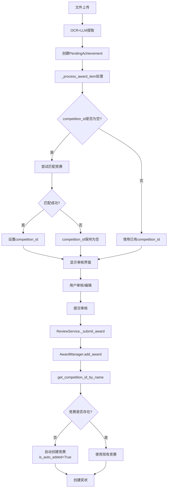
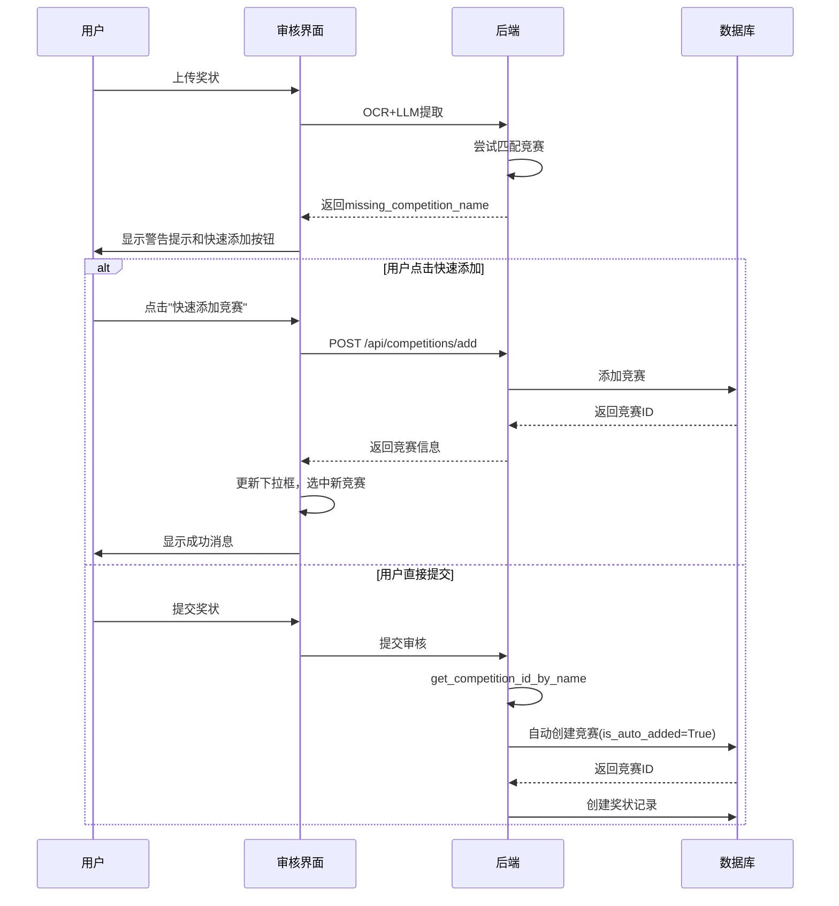

# 奖状导入与竞赛关系处理

**创建日期**: 2026-01-28  
**最后更新**: 2026-01-28  
**状态**: 已实现

---

## 1. 问题背景

在奖状导入流程中，当导入的奖状包含一个竞赛库中不存在的竞赛时，系统会如何处理？用户是否能够提前知道？如何优化用户体验？

### 1.1 问题描述

- **场景**: 用户上传奖状图片，OCR 和 LLM 提取出竞赛名称，但该竞赛在竞赛库中不存在
- **问题**: 
  1. 审核阶段用户看不到明确的提示，不知道竞赛不存在
  2. 系统会在提交时自动创建竞赛，但用户可能没有意识到
  3. 自动创建的竞赛信息不完整（只有名称），后续需要手动补充

---

## 2. 当前流程分析

### 2.1 奖状导入完整流程



### 2.2 关键代码位置

#### 2.2.1 文件导入审核阶段

**文件**: `app/routes/admin.py`  
**函数**: `_process_award_item` (第6172-6551行)

**处理逻辑**:
1. 如果 `competition_id` 为空，尝试通过以下方式匹配竞赛：
   - **优先级1**: 从模板的 `default_fields.competition_name` 匹配
   - **优先级2**: 从提取数据的 `competition_name` 字段匹配
2. 如果匹配成功，设置 `temp_award.competition_id`
3. **如果匹配失败，`competition_id` 保持为空**（原实现）

#### 2.2.2 最终提交阶段

**文件**: `backend/models/award.py`  
**函数**: `add_award` (第1220-1263行)

**处理逻辑**:
- 调用 `comp_mgr.get_competition_id_by_name(competition_name_in_file)`
- 该方法会先尝试匹配现有竞赛
- **如果找不到，自动添加竞赛**（`is_auto_added=True`）

**文件**: `backend/models/competition.py`  
**函数**: `get_competition_id_by_name` (第241-274行)

```python
def get_competition_id_by_name(self, competition_name: str) -> int:
    # 先尝试匹配现有竞赛
    comp = self.match_competition(competition_name)
    if comp:
        return comp.id
    
    # 如果找不到，自动添加竞赛（程序添加）
    logger.info(f"未找到竞赛 '{competition_name}'，自动添加为新竞赛（程序添加）")
    new_id = self.add_competition(
        name=competition_name,
        is_auto_added=True
    )
    return new_id
```

### 2.3 当前行为总结

**当导入一个不认识的竞赛时：**

1. **文件导入审核阶段**：
   - 如果匹配不到竞赛，`competition_id` 为空
   - 审核界面显示"未关联"状态
   - 用户可以在下拉框中选择已有竞赛，或保持为空
   - **问题**: 用户不知道系统会在提交时自动创建竞赛

2. **最终提交阶段**：
   - 如果 `competition_name` 存在但 `competition_id` 为空
   - 调用 `get_competition_id_by_name` 时会**自动创建竞赛**
   - 新竞赛只有名称，其他字段（官网、主办单位、时间等）为空
   - 标记为 `is_auto_added=True`（程序自动添加）

---

## 3. 存在的问题

### 3.1 用户体验问题

1. **审核阶段信息不明确**：
   - 如果竞赛不存在，用户看到的是"未关联"状态
   - 用户不知道系统会在提交时自动创建竞赛
   - 无法提前知道竞赛是否会被自动创建

2. **自动创建竞赛的问题**：
   - 自动创建的竞赛信息不完整（只有名称）
   - 用户可能没有意识到新竞赛被创建
   - 可能导致竞赛库中出现大量不完整的竞赛记录

3. **缺少用户控制**：
   - 用户无法选择是否自动创建竞赛
   - 无法在审核阶段就添加完整的竞赛信息

### 3.2 数据质量问题

1. **竞赛信息不完整**：
   - 自动创建的竞赛只有名称，缺少其他重要信息
   - 后续需要手动补充信息，增加维护成本

2. **竞赛重复风险**：
   - 如果用户稍后手动添加了相同名称的竞赛，可能造成重复
   - 虽然匹配逻辑会处理别名，但仍有风险

---

## 4. 解决方案

### 4.1 方案选择

经过分析，采用**方案一：在审核阶段提示并允许快速添加**。

**核心思路**: 在审核阶段检测到竞赛不存在时，明确提示用户，并提供快速添加竞赛的功能。

### 4.2 实现要点

1. **检测竞赛不存在**：
   - 在 `_process_award_item` 中，如果匹配不到竞赛，记录 `missing_competition_name`
   - 在模板中传递 `missing_competition_name` 标识

2. **界面改进**：
   - 如果竞赛不存在，显示警告提示："竞赛'XXX'未找到，提交时将自动创建"
   - 提供"快速添加竞赛"按钮，点击后弹出模态框
   - 模态框中预填充竞赛名称，允许用户补充其他信息

3. **快速添加API**：
   - 利用现有的 `/admin/api/competitions/add` 接口
   - 添加后立即刷新竞赛下拉框

4. **提交时处理**：
   - 如果用户已通过快速添加创建了竞赛，使用新创建的竞赛ID
   - 如果用户未添加，保持现有自动创建行为

### 4.3 方案优点

- **用户体验最佳**: 用户可以在审核阶段就处理竞赛不存在的问题
- **数据质量提升**: 减少自动创建的不完整竞赛
- **向后兼容**: 不影响现有流程，如果用户不处理，仍然会自动创建
- **实现成本适中**: 主要修改前端界面和添加快速添加功能

---

## 5. 实现细节

### 5.1 后端修改

#### 5.1.1 修改 `_process_award_item` 函数

**文件**: `app/routes/admin.py`  
**位置**: 第6335-6357行

**修改内容**:
- 当匹配不到竞赛时，记录缺失的竞赛名称
- 从 `data`、`_extract_data` 或模板的 `default_fields` 中获取竞赛名称
- 设置 `temp_award.missing_competition_name` 并记录日志

```python
else:
    # 如果匹配不到竞赛，记录缺失的竞赛名称
    missing_competition_name = data.get('competition_name')
    if not missing_competition_name:
        extract_data = data.get('_extract_data', {})
        if isinstance(extract_data, dict):
            missing_competition_name = extract_data.get('competition_name')
    # 如果仍然没有，尝试从模板获取
    if not missing_competition_name and template_id:
        try:
            from app.utils import get_doc_rec_context
            doc_rec_context = get_doc_rec_context()
            template_manager = doc_rec_context.template_manager
            template = template_manager.get_template(template_id)
            if template and template.default_fields:
                missing_competition_name = template.default_fields.get('competition_name')
        except Exception:
            pass
    # 设置缺失竞赛名称（用于前端提示）
    if missing_competition_name:
        temp_award.missing_competition_name = missing_competition_name
        logger.info(f"竞赛未找到: competition_name={missing_competition_name}，提交时将自动创建")
```

#### 5.1.2 修改返回值

**文件**: `app/routes/admin.py`  
**位置**: 第6542-6551行

**修改内容**:
- 在返回字典中添加 `missing_competition_name` 字段

```python
# 获取缺失的竞赛名称（如果存在）
missing_competition_name = getattr(temp_award, 'missing_competition_name', None)

return {
    'temp_award': temp_award,
    'competitions': all_competitions,
    # ... 其他字段
    'missing_competition_name': missing_competition_name
}
```

#### 5.1.3 修改 `file_import_results` 函数

**文件**: `app/routes/admin.py`  
**位置**: 第6817-6839行

**修改内容**:
- 将 `missing_competition_name` 传递给模板

```python
return render_template('admin/file_import/results.html',
                      # ... 其他参数
                      missing_competition_name=award_data.get('missing_competition_name'),
                      # ... 其他参数
)
```

### 5.2 前端修改

#### 5.2.1 修改竞赛选择框部分

**文件**: `app/templates/admin/file_import/results.html`  
**位置**: 第605-615行

**修改内容**:
- 当 `missing_competition_name` 存在时，显示警告提示
- 添加"快速添加竞赛"按钮

```html
<div class="mb-2">
    <label for="competition_id" class="form-label small">竞赛 <span class="text-danger">*</span></label>
    <select class="form-select form-select-sm" id="competition_id" name="competition_id">
        <option value="">未关联</option>
        
        <option value="{{ comp.id }}" selected>
            {{ comp.name }}
        </option>
        
    </select>
    
    <div class="alert alert-warning alert-dismissible fade show mt-2 mb-0" role="alert" style="padding: 0.5rem 0.75rem; font-size: 0.875rem;">
        <i class="bi bi-exclamation-triangle-fill me-1"></i>
        <strong>竞赛未找到：</strong>{{ missing_competition_name }}<br>
        <small>提交时将自动创建此竞赛。您也可以点击下方按钮立即添加。</small>
        <button type="button" class="btn-close" data-bs-dismiss="alert" aria-label="关闭" style="font-size: 0.7rem;"></button>
    </div>
    <button type="button" class="btn btn-sm btn-primary mt-2" id="quick_add_competition_btn" onclick="quickAddCompetition('{{ missing_competition_name }}')">
        <i class="bi bi-plus-circle me-1"></i>快速添加竞赛
    </button>
    
</div>
```

#### 5.2.2 添加 JavaScript 函数

**文件**: `app/templates/admin/file_import/results.html`  
**位置**: 第3517-3586行

**功能**:
- `quickAddCompetition(competitionName)`: 调用 API 快速添加竞赛
- 添加成功后自动更新下拉框并选中新竞赛
- 隐藏警告提示和按钮
- 显示成功消息

```javascript
// 快速添加竞赛
function quickAddCompetition(competitionName) {
    if (!competitionName) {
        showSuccessMessage('竞赛名称不能为空', null);
        return;
    }
    
    // 禁用按钮，显示加载状态
    const btn = document.getElementById('quick_add_competition_btn');
    const originalHtml = btn.innerHTML;
    btn.disabled = true;
    btn.innerHTML = '<i class="bi bi-hourglass-split me-1"></i>添加中...';
    
    // 调用API快速添加竞赛
    fetch('{{ url_for("admin.api_add_competition") }}', {
        method: 'POST',
        headers: {
            'Content-Type': 'application/json',
        },
        body: JSON.stringify({
            name: competitionName
        })
    })
    .then(response => response.json())
    .then(data => {
        if (data.success) {
            // 添加成功，刷新竞赛下拉框
            const competitionSelect = document.getElementById('competition_id');
            const newOption = document.createElement('option');
            newOption.value = data.competition.id;
            newOption.textContent = data.competition.name;
            newOption.selected = true;
            competitionSelect.appendChild(newOption);
            
            // 隐藏警告提示
            const alert = btn.previousElementSibling;
            if (alert && alert.classList.contains('alert')) {
                alert.remove();
            }
            
            // 移除快速添加按钮
            btn.remove();
            
            showSuccessMessage('竞赛添加成功！已自动关联', null);
        } else {
            // 添加失败，显示错误信息
            showSuccessMessage(data.message || '添加竞赛失败', null);
            btn.disabled = false;
            btn.innerHTML = originalHtml;
        }
    })
    .catch(error => {
        console.error('添加竞赛失败:', error);
        showSuccessMessage('添加竞赛失败，请稍后重试', null);
        btn.disabled = false;
        btn.innerHTML = originalHtml;
    });
}
```

### 5.3 API 接口

**文件**: `app/routes/admin.py`  
**路由**: `/admin/api/competitions/add`  
**方法**: `POST`  
**函数**: `api_add_competition` (第1200-1242行)

**功能**:
- 快速添加竞赛（只设置名称，其他字段为空）
- 检查竞赛是否已存在
- 返回新创建的竞赛信息

**请求格式**:
```json
{
    "name": "竞赛名称"
}
```

**响应格式**:
```json
{
    "success": true,
    "message": "竞赛添加成功",
    "competition": {
        "id": 123,
        "name": "竞赛名称"
    }
}
```

---

## 6. 功能说明

### 6.1 用户操作流程

当导入一个不认识的竞赛时：

1. **审核阶段**：
   - 系统检测到竞赛不存在
   - 显示警告提示："竞赛未找到：XXX，提交时将自动创建此竞赛。您也可以点击下方按钮立即添加。"
   - 显示"快速添加竞赛"按钮

2. **快速添加**（可选）：
   - 用户点击"快速添加竞赛"按钮
   - 系统调用 API 添加竞赛
   - 添加成功后：
     - 自动更新竞赛下拉框
     - 自动选中新添加的竞赛
     - 隐藏警告提示和按钮
     - 显示成功消息："竞赛添加成功！已自动关联"

3. **自动创建**（向后兼容）：
   - 如果用户不点击快速添加，直接提交
   - 系统在提交时自动创建竞赛
   - 自动创建的竞赛标记为 `is_auto_added=True`

### 6.2 数据流



---

## 7. 测试验证

### 7.1 测试用例

#### 测试用例 1: 导入不存在的竞赛 - 快速添加

**前置条件**:
- 竞赛库中不存在"福建省高校企业竞争模拟大赛"
- 准备测试图片：`images\其他系\4.jpg`

**测试步骤**:
1. 启动应用并登录管理员账号
2. 进入文件导入页面，上传 `images\其他系\4.jpg`
3. 等待 OCR 和 LLM 提取完成
4. 在审核界面检查：
   - [ ] 应显示警告："竞赛未找到：福建省高校企业竞争模拟大赛"
   - [ ] 应显示"快速添加竞赛"按钮
5. 点击"快速添加竞赛"按钮
6. 检查结果：
   - [ ] 应显示"竞赛添加成功！已自动关联"
   - [ ] 竞赛下拉框应自动选中新添加的竞赛
   - [ ] 警告提示和按钮应消失
7. 提交奖状
8. 检查数据库：
   - [ ] 竞赛库中应存在"福建省高校企业竞争模拟大赛"
   - [ ] 该竞赛的 `is_auto_added` 应为 `False`（手动添加）

**预期结果**: 所有检查项通过

#### 测试用例 2: 导入不存在的竞赛 - 自动创建

**前置条件**:
- 竞赛库中不存在"测试竞赛ABC"
- 准备测试图片（包含"测试竞赛ABC"）

**测试步骤**:
1. 启动应用并登录管理员账号
2. 进入文件导入页面，上传测试图片
3. 等待 OCR 和 LLM 提取完成
4. 在审核界面检查：
   - [ ] 应显示警告："竞赛未找到：测试竞赛ABC"
   - [ ] 应显示"快速添加竞赛"按钮
5. **不点击快速添加按钮**，直接提交奖状
6. 检查数据库：
   - [ ] 竞赛库中应存在"测试竞赛ABC"
   - [ ] 该竞赛的 `is_auto_added` 应为 `True`（自动添加）
   - [ ] 奖状记录应正确关联到该竞赛

**预期结果**: 所有检查项通过

#### 测试用例 3: 导入已存在的竞赛

**前置条件**:
- 竞赛库中已存在"蓝桥杯全国软件和信息技术专业人才大赛"
- 准备测试图片（包含该竞赛名称）

**测试步骤**:
1. 启动应用并登录管理员账号
2. 进入文件导入页面，上传测试图片
3. 等待 OCR 和 LLM 提取完成
4. 在审核界面检查：
   - [ ] 不应显示警告提示
   - [ ] 不应显示"快速添加竞赛"按钮
   - [ ] 竞赛下拉框应自动选中"蓝桥杯全国软件和信息技术专业人才大赛"
5. 提交奖状
6. 检查数据库：
   - [ ] 奖状记录应正确关联到该竞赛
   - [ ] 不应创建新的竞赛记录

**预期结果**: 所有检查项通过

### 7.2 测试结果

**测试日期**: 待补充  
**测试人员**: 待补充  
**测试状态**: 待测试

| 测试用例 | 状态 | 备注 |
|---------|------|------|
| 测试用例 1: 快速添加 | 待测试 | - |
| 测试用例 2: 自动创建 | 待测试 | - |
| 测试用例 3: 已存在竞赛 | 待测试 | - |

---

## 8. 注意事项

### 8.1 API 认证

- API 路由使用 `@require_role('admin')` 装饰器
- 需要管理员权限才能调用快速添加接口
- 前端调用时会自动携带 session cookie

### 8.2 向后兼容

- 如果用户不点击快速添加，系统仍会自动创建竞赛
- 保持原有行为，不影响现有流程
- 自动创建的竞赛标记为 `is_auto_added=True`

### 8.3 数据质量

- 快速添加的竞赛只设置名称，其他字段为空
- 用户可以在竞赛管理页面后续补充完整信息
- 自动创建的竞赛同样需要后续补充信息

### 8.4 竞赛匹配逻辑

- 系统使用 `CompetitionManager.match_competition()` 进行匹配
- 支持精确匹配（名称或别名）
- 支持包含匹配（输入字符串包含别名）
- 匹配时忽略符号、大小写、空格

---

## 9. 后续优化建议

### 9.1 功能增强

1. **批量处理**：
   - 如果多个奖状都缺少同一个竞赛，提供批量添加功能

2. **竞赛建议**：
   - 基于竞赛名称，提供相似竞赛的建议
   - 帮助用户识别是否应该使用已有竞赛

3. **完整信息添加**：
   - 快速添加时允许用户填写更多信息（官网、主办单位等）
   - 减少后续补充信息的工作量

### 9.2 数据质量

1. **竞赛信息验证**：
   - 自动创建的竞赛标记为"待完善"
   - 在竞赛管理页面提供筛选和批量编辑功能

2. **重复检测**：
   - 定期检测可能的重复竞赛
   - 提供合并功能

---

## 10. 相关文档

- [文件审核流程说明_界面.md](./文件审核流程说明_界面.md)
- [成果审核流程设计文档.md](./成果审核流程设计文档.md)
- [数据库结构说明](../../database/DATABASE_SCHEMA.md)

---

## 11. 更新日志

| 日期 | 版本 | 更新内容 | 作者 |
|------|------|---------|------|
| 2026-01-28 | 1.0 | 初始版本，实现竞赛不存在时的提示和快速添加功能 | - |
