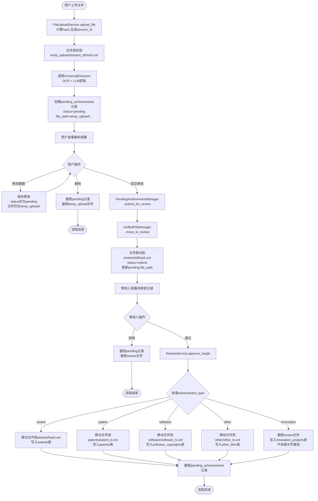
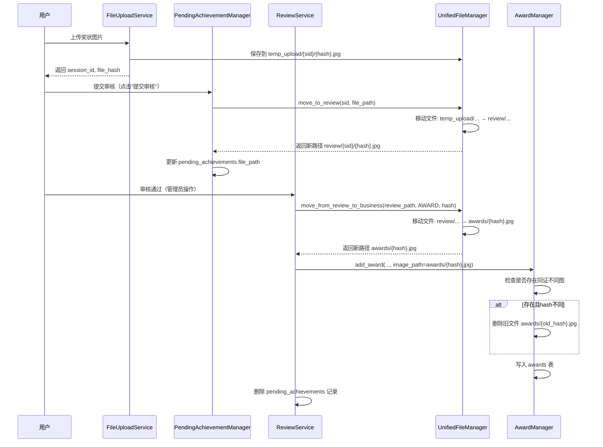
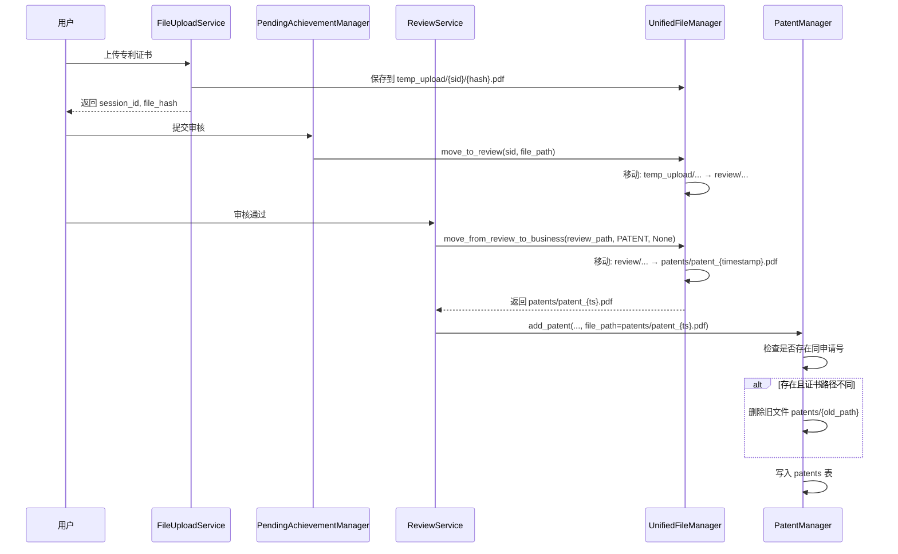
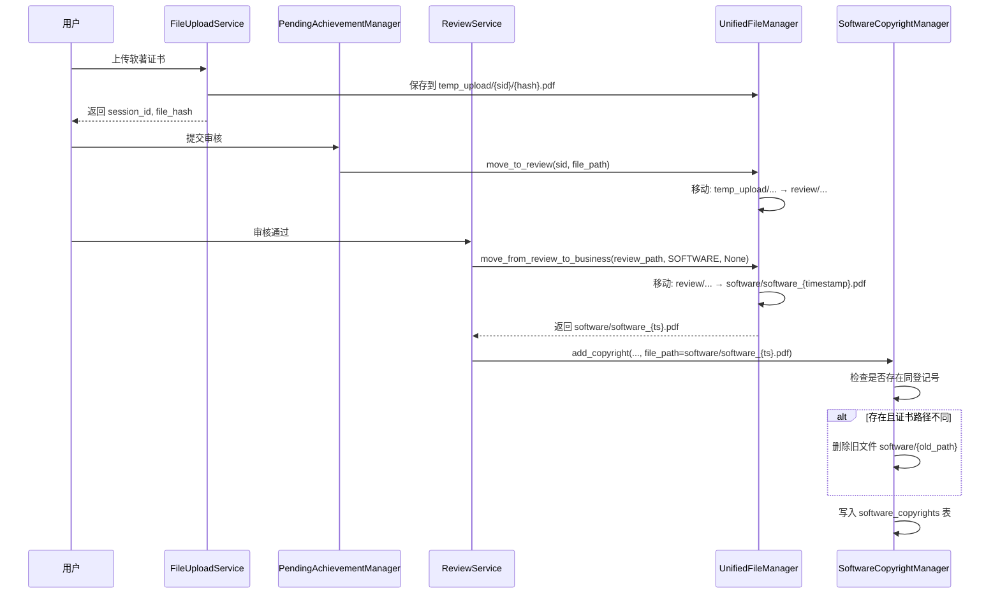
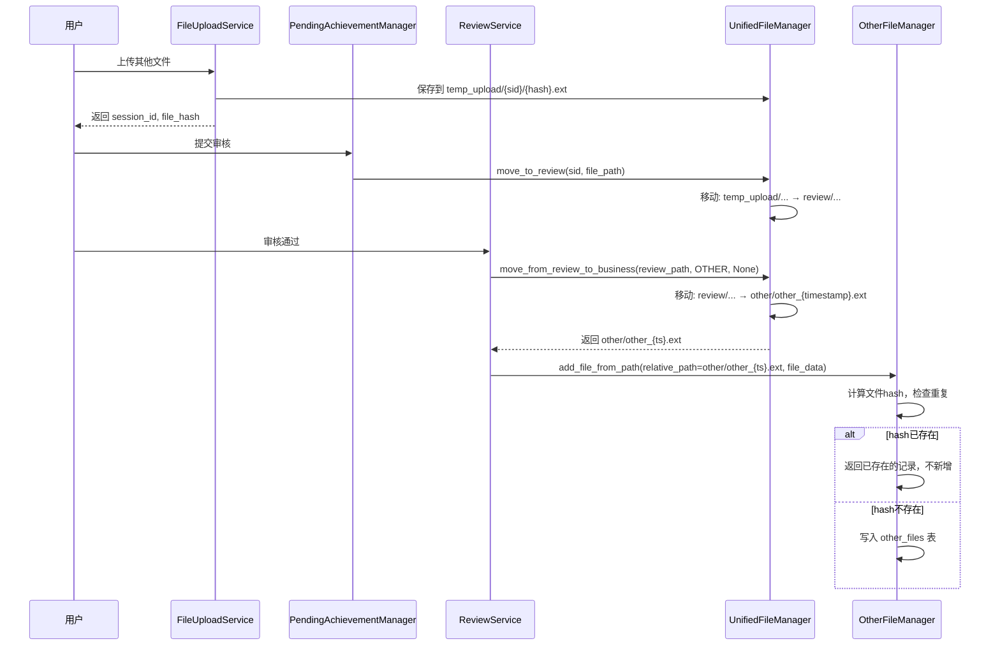
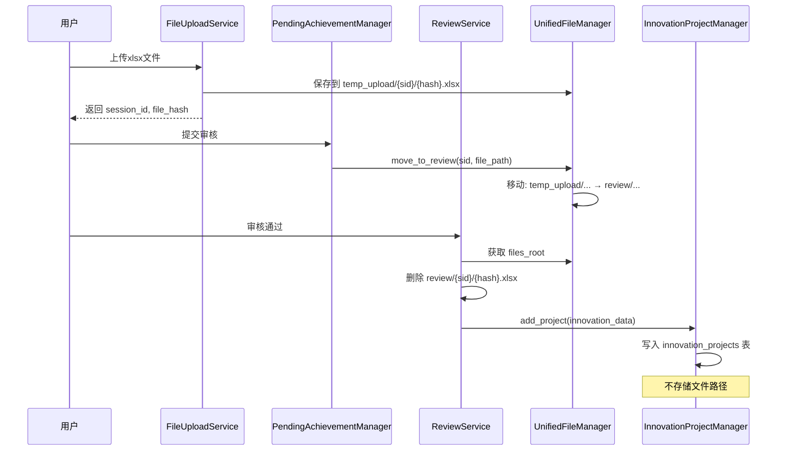

# 统一文件管理系统设计文档 v2.1

## 1. 设计背景

### 1.1 原有问题

重构前，文件管理系统存在以下严重问题：

| 问题 | 具体表现 | 影响 |
|------|----------|------|
| **目录混乱** | `files/images/`、`files/`、`temp/uploads/` 等多个目录存放不同类型文件 | 难以维护，路径不一致 |
| **会话垃圾堆积** | 用户上传后未处理的文件长期占用存储空间，无自动清理机制 | 磁盘空间浪费 |
| **硬编码路径** | 配置路径散布在各个模块中（`config_loader.get_path()`、`current_app.config.get('IMAGES_DIR')` 等） | 难以统一管理，修改困难 |
| **重复文件存储** | 同一文件可能在多个目录中存在副本 | 存储浪费 |
| **级联删除缺失** | 业务数据删除时，关联文件无法自动清理 | 产生孤立文件 |
| **文件覆盖问题** | 使用 hash 命名时，不同业务记录引用相同文件会导致覆盖 | 数据丢失风险 |

### 1.2 设计目标

- **统一管理**: 所有文件操作通过 `UnifiedFileManager` 及 `FileUploadService` 进行
- **审核流程支持**: 支持上传 → `temp_upload` → 提交审核 → `review` → 审核通过 → 业务目录的完整流程
- **零硬编码**: 路径、配置均从 `config` 与统一文件管理器获取，缺失即抛异常
- **无降级**: 不提供默认路径或静默兜底，错误立即暴露
- **去重与覆盖处理**: 不同文件类型采用不同命名策略，避免覆盖问题

---

## 2. 用户操作流程与文件流转

### 2.1 业务流程详细说明

#### 阶段一：文件上传与解析

1. **用户上传文件**
   - 用户（学生/教师/管理员）在成果提交页面选择文件（图片、PDF、Excel等）并点击上传
   - 系统调用 `FileUploadService.upload_file()` 处理上传
   - 系统计算文件的 MD5 hash 值，生成唯一的 `session_id`（UUID）
   - **文件保存位置**: `files/temp_upload/{session_id}/{hash}.{ext}`
   - 返回 `session_id` 和 `file_hash` 给前端

2. **自动调用文档抽取模块**
   - 系统自动调用 `UniversalExtractor` 对文件进行识别和解析
   - **OCR 文字识别**: 提取图片/PDF中的文字内容
   - **LLM 结构化提取**: 从OCR文字中提取结构化数据（如竞赛名称、获奖等级、获奖者等）
   - **数据验证**: 验证提取数据的完整性和准确性

3. **创建待审核记录**
   - 系统在 `pending_achievements` 表中创建记录
   - **状态**: `status = 'pending'`（等待用户审核）
   - **存储内容**: 文件路径（`temp_upload/{session_id}/{hash}.{ext}`）、文件hash、OCR文本、LLM提取结果、验证结果等
   - **文件位置**: 文件仍在 `temp_upload/` 目录中

#### 阶段二：用户编辑与提交

4. **用户查看解析结果**
   - 用户进入成果编辑页面，查看AI解析出的结构化数据
   - 页面显示：原始文件预览、OCR识别文本、LLM提取的字段（可编辑表单）

5. **用户编辑数据**
   - 用户可以对解析结果进行修改、补充或更正
   - 修改后点击"保存"，系统更新 `pending_achievements` 表中的 `achievement_data` 字段
   - **状态不变**: `status` 仍为 `'pending'`
   - **文件位置不变**: 文件仍在 `temp_upload/` 目录中

6. **用户提交审核或删除**
   - **选项A - 提交审核**: 用户确认数据无误后，点击"提交审核"按钮
     - 系统调用 `PendingAchievementManager.submit_for_review()`
     - **文件移动**: 调用 `UnifiedFileManager.move_to_review(session_id, file_path)`
     - **文件新位置**: `files/review/{session_id}/{hash}.{ext}`
     - **状态更新**: `status = 'submit'`（等待审核人审核）
     - **数据库更新**: `pending_achievements.file_path` 更新为新的 `review/...` 路径
   
   - **选项B - 删除**: 用户点击"删除"按钮
     - 系统删除 `pending_achievements` 表中的记录
     - 系统删除 `temp_upload/` 中的文件
     - 流程结束

#### 阶段三：审核人审核

7. **审核人进入审核页面**
   - 审核人（管理员/教师）进入成果审核页面
   - 页面显示所有 `status = 'submit'` 的待审核记录
   - 审核人可以逐项查看：原始文件、解析数据、提交人信息等

8. **审核人审核并操作**
   - **选项A - 审核通过**: 审核人确认数据无误，点击"通过"按钮
     - 系统调用 `ReviewService.approve_single(pending_id, reviewer)`
     - 根据 `pending_achievements.achievement_type` 调用对应的 `_submit_*` 方法
     - **文件移动**: 调用 `UnifiedFileManager.move_from_review_to_business(review_path, file_type, image_hash)`
     - **数据入库**: 根据类型写入对应的正式表，并删除 `pending_achievements` 记录
     - **文件最终位置**: 根据类型移动到不同业务目录（见下方详细说明）
   
   - **选项B - 审核拒绝**: 审核人点击"拒绝"按钮
     - 系统删除 `pending_achievements` 记录
     - 系统删除 `review/` 目录中的文件
     - 流程结束

#### 阶段四：文件最终入库（审核通过后）

根据成果类型，文件会移动到不同的业务目录并写入对应的正式表：

- **奖状 (Award)**
  - 文件从 `review/{session_id}/{hash}.jpg` 移动到 `awards/{hash}.jpg`
  - 数据写入 `awards` 表
  - 使用 hash 命名，支持去重（相同hash直接覆盖）

- **专利 (Patent)**
  - 文件从 `review/{session_id}/{hash}.pdf` 移动到 `patents/patent_{timestamp}.pdf`
  - 数据写入 `patents` 表
  - 使用时间戳命名，避免覆盖问题

- **软著 (Software)**
  - 文件从 `review/{session_id}/{hash}.pdf` 移动到 `software/software_{timestamp}.pdf`
  - 数据写入 `software_copyrights` 表
  - 使用时间戳命名

- **其他 (Other)**
  - 文件从 `review/{session_id}/{hash}.ext` 移动到 `other/other_{timestamp}.ext`
  - 数据写入 `other_files` 表
  - 使用时间戳命名，hash 重复则返回已存在记录

- **大创 (Innovation)**
  - **文件删除**: 从 `review/{session_id}/{hash}.xlsx` 直接删除（大创不需要保留原始文件）
  - 数据写入 `innovation_projects` 表
  - 不存储文件路径

### 2.2 业务流程流程图



### 2.3 文件管理模块在各阶段的作用

| 业务流程阶段 | 用户操作 | 文件位置变化 | 本模块职责 | 调用的接口 |
|-------------|---------|-------------|-----------|-----------|
| **1. 上传阶段** | 用户选择文件并上传 | 无 → `temp_upload/{session_id}/{hash}.{ext}` | 保存文件到临时上传目录 | `FileUploadService.upload_file()`（内部直接写入） |
| **2. 解析阶段** | 系统自动调用抽取模块 | 文件位置不变（仍在 `temp_upload/`） | 无操作 | 无 |
| **3. 创建待审核记录** | 系统创建 pending 记录 | 文件位置不变 | 无操作 | 无 |
| **4. 用户编辑** | 用户修改数据并保存 | 文件位置不变 | 无操作 | 无 |
| **5. 提交审核** | 用户点击"提交审核" | `temp_upload/{sid}/{hash}.ext` → `review/{sid}/{hash}.ext` | 将文件从临时上传目录移动到审核目录 | `move_to_review(session_id, file_path)` |
| **6. 审核通过** | 审核人点击"通过" | `review/{sid}/{hash}.ext` → 业务目录 | 根据类型移动到对应业务目录 | `move_from_review_to_business(review_path, file_type, image_hash)` |
| **7. 审核拒绝** | 审核人点击"拒绝" | `review/{sid}/{hash}.ext` → 删除 | 删除审核目录中的文件 | 直接删除或通过清理机制 |

### 2.4 各类型文件最终入库路径

| 成果类型 | 审核通过后文件位置 | 数据表 | 命名规则 | 去重策略 |
|---------|------------------|--------|---------|---------|
| **奖状** | `awards/{hash}.{ext}` | `awards` | hash 命名 | 基于 `image_hash` + `certificate_id` |
| **专利** | `patents/patent_{timestamp}.{ext}` | `patents` | 时间戳命名 | 基于 `application_number` |
| **软著** | `software/software_{timestamp}.{ext}` | `software_copyrights` | 时间戳命名 | 基于 `registration_number` |
| **其他** | `other/other_{timestamp}.{ext}` | `other_files` | 时间戳命名 | 基于文件 SHA256 hash |
| **大创** | **删除**（不保留文件） | `innovation_projects` | 无 | 基于业务字段 |

---

## 3. 目录结构与命名

### 3.1 目录结构（已实现）

```
files/
├── temp_upload/          # 临时上传 (按 session_id 分子目录，定期清理)
│   └── {session_id}/{hash}.{ext}
├── review/               # 审核阶段 (按 session_id 分子目录，定期清理)
│   └── {session_id}/{hash}.{ext}
├── temp_images/          # 临时测试图片 (定期清理)
├── export/               # 导出临时文件 (定期清理)
├── awards/               # 奖状 (永久)  {hash}.{ext}
├── patents/              # 专利 (永久)  patent_{timestamp}.{ext}
├── software/             # 软著 (永久)  software_{timestamp}.{ext}
├── other/                # 其他文件 (永久)  other_{timestamp}.{ext}
└── laboratories/         # 实验室 (永久)
    └── {lab_id}/{covers|downloads|photos}/
```

### 3.2 文件命名与清理策略

| 类型       | 命名规则               | 清理策略          |
|------------|------------------------|-------------------|
| temp_upload | `{session_id}/{hash}.{ext}` | mtime 超时清理（1小时） |
| review      | `{session_id}/{hash}.{ext}` | mtime 超时清理（24小时） |
| awards      | `{hash}.{ext}`         | 不自动清理        |
| patents     | `patent_{timestamp}.{ext}` | 不自动清理        |
| software    | `software_{timestamp}.{ext}` | 不自动清理        |
| other       | `other_{timestamp}.{ext}` | 不自动清理        |

---

## 4. 核心接口 (UnifiedFileManager)

### 4.1 查询与路径

- `find_file_by_path(relative_path: str) -> Path`  
  根据相对路径查找文件，支持 PDF→PNG 等转换。
- `get_absolute_path(relative_path: str) -> Path`  
  返回相对路径对应的绝对路径。

### 4.2 审核流程专用（本模块核心）

- `move_to_review(session_id: str, file_path: str) -> str`  
  将 `temp_upload/{session_id}/{filename}` 移动到 `review/{session_id}/{filename}`，返回新相对路径。
- `move_from_review_to_business(review_path: str, file_type: FileType, image_hash: Optional[str] = None) -> str`  
  将 `review/...` 移动到业务目录；`image_hash` 非空时用于奖状等 hash 命名，否则用时戳命名。返回新相对路径。

### 4.3 业务与实验室文件

#### 业务文件保存

- `save_business_file(file_type: FileType, file_data: Any, filename: str) -> Tuple[Path, str]`  
  保存到对应业务目录，返回 (绝对路径, 相对路径)。**适用于 Flask FileStorage 对象（上传场景）**。
- `save_business_file_from_path(file_type: FileType, source_path: Path, filename: str, delete_source: bool = False) -> Tuple[str, str]`  
  从文件路径保存业务文件，返回 (绝对路径, 相对路径)。**适用于已有文件路径的场景，无需创建适配器**。`delete_source=True` 时复制后删除源文件（移动），`False` 时仅复制。

#### 实验室文件保存

- `save_lab_file(lab_id, lab_file_type: LabFileType, file_data, filename: str) -> Tuple[str, str]`  
  保存实验室文件。**适用于 Flask FileStorage 对象（上传场景）**。
  **注意**：`LabFileType.COVER`（封面图片）已不再使用，封面图片直接保存到 `static/images/laboratory_covers/`，不在文件管理范围内。
- `save_lab_file_from_path(lab_id: int, lab_file_type: LabFileType, source_path: Path, filename: str, delete_source: bool = False) -> Tuple[str, str]`  
  从文件路径保存实验室文件，返回 (绝对路径, 相对路径)。**适用于已有文件路径的场景，无需创建适配器**。`delete_source=True` 时复制后删除源文件（移动），`False` 时仅复制。
  **注意**：`LabFileType.COVER`（封面图片）已不再使用。

#### 实验室封面图片（不在文件管理范围内）

**设计决策**：实验室封面图片不通过统一文件管理器管理，原因：
- 每个实验室只有一个封面，不需要文件管理的复杂功能（去重、hash等）
- 直接保存到 `static/images/laboratory_covers/` 目录
- 通过 Flask `static` 路由访问：`url_for('static', filename=lab.cover_image)`
- 路径格式：`images/laboratory_covers/lab_{lab_id}_{timestamp}.{ext}`

#### 其他操作

- `save_export_file(filename: str, content: bytes) -> Tuple[Path, str]`  
  保存导出文件到 `export/`。
- `delete_business_file(file_type: FileType, filename: str) -> bool`  
  删除业务文件。
- `delete_lab_file(...)`  
  删除实验室文件。

#### 接口选择原则

- **上传场景**（Flask `request.files` 对象）：使用 `save_business_file()` 或 `save_lab_file()`
- **已有路径场景**（`Path` 对象）：使用 `save_business_file_from_path()` 或 `save_lab_file_from_path()`
- **避免适配器**：不要创建适配器类来适配 `Path` 对象，直接使用 `*_from_path` 方法

### 4.4 清理

- `cleanup_expired_sessions(temp_upload_hours, review_hours, temp_images_hours, export_hours) -> Dict`  
  按 mtime 清理过期临时/审核/测试/导出文件。
- `handle_pdf_conversion_cleanup(source_dir, pdf_filename)` / `cleanup_pdf_conversion_artifacts(directory)`  
  PDF 转换产物清理。

### 4.5 枚举

- `FileType`: AWARD, PATENT, SOFTWARE, OTHER, SESSION；`directory` 对应 awards、patents、software、other 等。
- `SessionStatus`: TEMP_UPLOAD, REVIEW, TEMP_IMAGES, EXPORT。
- `LabFileType`: COVER, DOWNLOADS, PHOTOS。

---

## 5. 各类型文件流转过程

以下详细说明**奖状、专利、软著、其他、大创**五类文件的流转过程，包括函数调用、文件变动及本模块接口使用。

### 5.1 奖状 (Award)

#### 业务流程



#### 函数调用与文件变动

| 阶段 | 函数/流程 | 文件变动 | 本模块接口 |
|------|-----------|----------|------------|
| **上传** | `FileUploadService.upload_file()` | 写入 `temp_upload/{session_id}/{hash}.jpg` | 无（上传服务内部直接写入） |
| **提交审核** | `PendingAchievementManager.submit_for_review()` → 检测到 `ext_info.session_id` | `temp_upload/{sid}/{hash}.jpg` → `review/{sid}/{hash}.jpg` | `move_to_review(session_id, file_path)` |
| **审核通过** | `ReviewService._submit_award()` | `review/{sid}/{hash}.jpg` → `awards/{hash}.jpg` | `move_from_review_to_business(review_path, FileType.AWARD, image_hash)` |
| **入库** | `AwardManager.add_award()` | 若找到 existing 且 `image_hash` 不同：先删除旧 `awards/{old_hash}.jpg`，再更新记录 | 无（Manager 使用 `find_file_by_path` 查找旧文件） |

#### 特殊处理

- **去重策略**: 基于 `image_hash` 和 `certificate_id` 双重匹配
- **覆盖处理**: 若同一证书（`certificate_id` 相同）但图片不同（`image_hash` 不同），先删除旧文件再保存新文件，避免垃圾文件堆积

---

### 5.2 专利 (Patent)

#### 业务流程



#### 函数调用与文件变动

| 阶段 | 函数/流程 | 文件变动 | 本模块接口 |
|------|-----------|----------|------------|
| **上传** | `FileUploadService.upload_file()` | `temp_upload/{session_id}/{hash}.pdf` | 无 |
| **提交审核** | `PendingAchievementManager.submit_for_review()` | `temp_upload/...` → `review/{sid}/{hash}.pdf` | `move_to_review(session_id, file_path)` |
| **审核通过** | `ReviewService._submit_patent()` | `review/{sid}/{hash}.pdf` → `patents/patent_{timestamp}.pdf` | `move_from_review_to_business(review_path, FileType.PATENT, None)` |
| **入库** | `PatentManager.add_patent(..., file_path=业务路径)` 或 `update_patent(..., file_path=...)` | 若已有同申请号且证书路径不同：删除旧 `patents/` 文件 | 无 |

#### 特殊处理

- **去重策略**: 基于 `application_number`（专利申请号）
- **命名策略**: 使用时间戳 `patent_{timestamp}.{ext}`，避免 hash 冲突导致的覆盖问题

---

### 5.3 软著 (Software)

#### 业务流程



#### 函数调用与文件变动

| 阶段 | 函数/流程 | 文件变动 | 本模块接口 |
|------|-----------|----------|------------|
| **上传** | `FileUploadService.upload_file()` | `temp_upload/{session_id}/{hash}.pdf` | 无 |
| **提交审核** | `PendingAchievementManager.submit_for_review()` | `temp_upload/...` → `review/{sid}/{hash}.pdf` | `move_to_review(session_id, file_path)` |
| **审核通过** | `ReviewService._submit_software()` | `review/{sid}/{hash}.pdf` → `software/software_{timestamp}.pdf` | `move_from_review_to_business(review_path, FileType.SOFTWARE, None)` |
| **入库** | `SoftwareCopyrightManager.add_copyright(..., file_path=...)` / `update_copyright(..., file_path=...)` | 若已有同登记号且证书路径不同：删除旧 `software/` 文件 | 无 |

#### 特殊处理

- **去重策略**: 基于 `registration_number`（软著登记号）
- **命名策略**: 使用时间戳 `software_{timestamp}.{ext}`

---

### 5.4 其他 (Other)

#### 业务流程



#### 函数调用与文件变动

| 阶段 | 函数/流程 | 文件变动 | 本模块接口 |
|------|-----------|----------|------------|
| **上传** | `FileUploadService.upload_file()` | `temp_upload/{session_id}/{hash}.ext` | 无 |
| **提交审核** | `PendingAchievementManager.submit_for_review()` | `temp_upload/...` → `review/{sid}/{hash}.ext` | `move_to_review(session_id, file_path)` |
| **审核通过** | `ReviewService._submit_other()` | `review/{sid}/{hash}.ext` → `other/other_{timestamp}.ext` | `move_from_review_to_business(review_path, FileType.OTHER, None)` |
| **入库** | `OtherFileManager.add_file_from_path(relative_path, file_data)` | 仅写库，文件已在 `other/`；hash 重复则返回已存在记录 | 无 |

#### 特殊处理

- **去重策略**: 基于文件 SHA256 hash；hash 相同则返回已存在记录，不新增
- **命名策略**: 使用时间戳 `other_{timestamp}.{ext}`

---

### 5.5 大创 (Innovation)

#### 业务流程



#### 函数调用与文件变动

| 阶段 | 函数/流程 | 文件变动 | 本模块接口 |
|------|-----------|----------|------------|
| **上传** | `FileUploadService.upload_file()` | `temp_upload/{session_id}/{hash}.xlsx` | 无 |
| **提交审核** | `PendingAchievementManager.submit_for_review()` | `temp_upload/...` → `review/{sid}/{hash}.xlsx` | `move_to_review(session_id, file_path)` |
| **审核通过** | `ReviewService._submit_innovation()` | **删除** `review/{session_id}/{hash}.xlsx`，不落业务目录 | 直接使用 `files_root / file_path` 后 `unlink()` |
| **入库** | `InnovationProjectManager.add_project()` | 仅写 `innovation_projects` 表，无文件存储 | 无 |

#### 特殊处理

- **文件策略**: 大创项目不需要保留原始 xlsx 文件，审核通过后直接删除
- **数据来源**: 从 xlsx 中提取的数据已写入数据库，原始文件不再需要

---

## 6. 配置与异常

### 6.1 配置管理

- **配置来源**: 从 `config.loader` 及 `config/settings.json` 的 `unified_file_manager`、`files` 等加载
- **配置缺失**: 缺失即抛出 `ConfigurationError`，不提供默认值

### 6.2 异常处理

- **异常类型**: `ConfigurationError`、`FileNotFoundError`、`InvalidFileTypeError`、`OperationFailedError`
- **处理原则**: 不吞掉、不降级，错误立即暴露

---

## 7. 集成与测试

### 7.1 引用 UnifiedFileManager 的模块

- **业务 Manager**: `backend/models`（award、patent、software_copyright、other_file、laboratory 等）
- **服务层**: `backend/services`（file_upload_service、review_service）
- **路由层**: `app/routes`（admin、admin_review 等）
- **工具层**: `backend/utils/export_utils`

### 7.2 流转测试

- **测试脚本**: `tests/test_files.py`
- **测试数据**: `images/测试图片` 下各类别样本
- **测试流程**: 上传 → 提交审核 → 审核通过，每步校验目录
- **测试报告**: `tests/report/文件流转验证.html`

### 7.3 详细流转说明

见 `文件流转汇总.md`。

---

## 8. 使用示例（开发者）

```python
from backend.services.unified_file_manager import get_unified_file_manager, FileType

fm = get_unified_file_manager()

# 查找
path = fm.find_file_by_path("awards/abc123.jpg")

# 审核流程移动
new_path = fm.move_to_review(session_id, "temp_upload/.../x.jpg")
final_path = fm.move_from_review_to_business("review/.../x.jpg", FileType.AWARD, image_hash="abc123")

# 业务保存（直接上传场景）
abs_path, rel_path = fm.save_business_file(FileType.PATENT, file_obj, "cert.pdf")

# 清理
fm.cleanup_expired_sessions(temp_upload_hours=1, review_hours=24, ...)
```

---

*设计文档 v2.1，与当前实现及 `文件流转汇总.md` 一致。*
