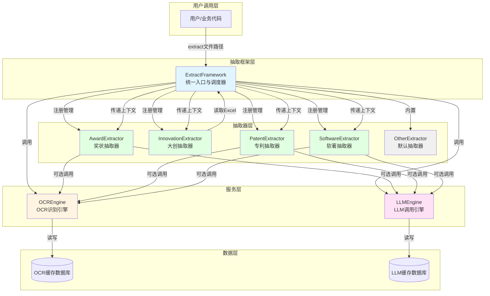

# 业务流程说明文档

[成果审核](成果审核流程设计文档.md)

 [业务流程梳理.md](业务流程梳理.md) 

 [文件审核流程说明_界面.md](文件审核流程说明_界面.md) 

# 核心模块

## 信息抽取模块

  输入任意文件，将文件分类，对于特定能够细致识别的种类（奖状，专利，软著，大创，其他），会有针对性地抽取有效信息，并且返回抽取内容。最重要最核心的就是奖状内容的抽取。

这个模块比较复杂，且支持扩展（通过注册更多的抽取器来扩展功能）。由下面几个部分构成：

模块之间的动/静态关系，查看[架构关系图](extract/架构关系图.md)

# 设计文档快速索引

| 组件                                                         | 职责                                       | 相关文档                                                     | 测试程序           |
| ------------------------------------------------------------ | ------------------------------------------ | ------------------------------------------------------------ | ------------------ |
| [ExtractFramework：框架设计](extract/抽取框架设计.md)        | 统一入口，管理抽取器注册与调度             | [汇总测试文档](extract/测试文档.md)、 [LLM抽取器选择详细说明.md](extract\LLM抽取器选择详细说明.md) | tests/extract/*.py |
| **OCREngine**“： [OCR识别与缓存设计.md](ocr\OCR识别与缓存设计.md) | 图片/PDF文本识别，支持缓存和精度分级       | [ocr_测试用例.md](ocr\ocr_测试用例.md)、[OCR供应商故障切换与管理员状态管理.md](ocr\OCR供应商故障切换与管理员状态管理.md) |                    |
| [LLMEngine：LLM 模块设计](extract/LLM模块设计.md)            | LLM调用，支持缓存和多种Provider            | [LLM测试用例.md](extract\LLM测试用例.md)                     |                    |
| AwardExtractor [奖状抽取器设计](extract\award_extractor_design.md) | 奖状证书结构化抽取                         |                                                              |                    |
| **InnovationExtractor**                                      | Excel大创项目抽取                          | [大创抽取器设计.md](extract\大创抽取器设计.md)               |                    |
| **PatentExtractor**                                          | 专利证书结构化抽取                         | [patent_software_extractors.md](extract\patent_software_extractors.md) |                    |
| **SoftwareExtractor**                                        | 软著证书结构化抽取                         | [patent_software_extractors.md](extract\patent_software_extractors.md) |                    |
| **OtherExtractor**                                           | 默认抽取器，处理无法匹配的文件             | 在框架中                                                     |                    |
| 模版设计（用于奖状）                                         | 用于增强奖状的抽取效果                     | [template-api-reference.md](extract\template-api-reference.md) ， [template-testing-guide.md](extract\template-testing-guide.md) ， [模板匹配规则_2026-01-22.md](extract\模板匹配规则_2026-01-22.md)  缺总的一份设计文档 |                    |
| 统一文件管理： [文件管理设计.md](文件管理\文件管理设计.md)   | 解决文件上传、归档等各个过程文件的存储问题 | [文件流转API完整测试用例设计.md](文件管理\文件流转API完整测试用例设计.md) ， [文件流转汇总.md](文件管理\文件流转汇总.md) |                    |

