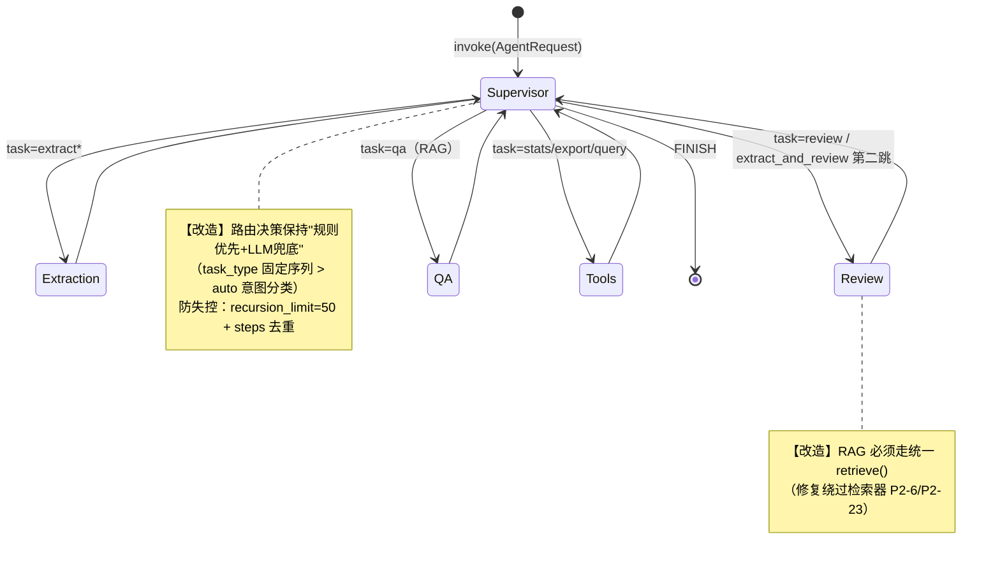
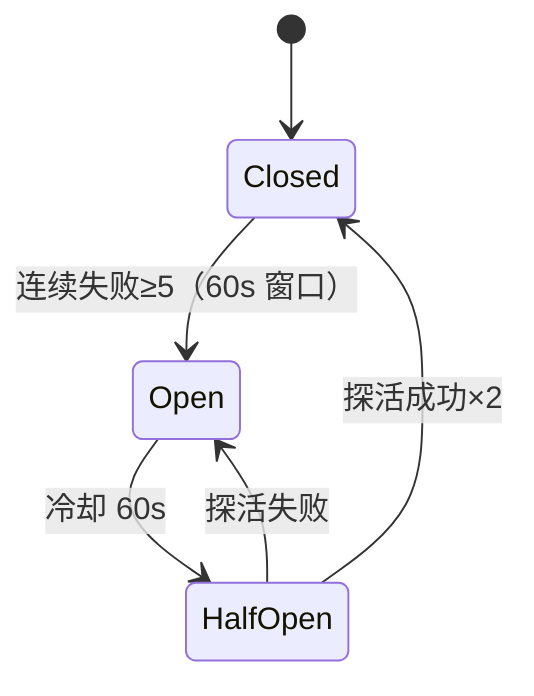

# AwardIE-AgentFlow AI 层设计（SDD·第五章）

| 项目 | 内容 |
| --- | --- |
| **文档版本** | v1.3 |
| **编写日期** | 2026-08-17 |
| **依据文档** | 需求文档 v1.8（3.3/3.7/8.6/7.4 / 1.7 D3 / **2.0.3 BR-1 白名单为级别认定唯一口径** / 交叉审查 CR-6；v1.3 依据刷新） |
| **标注约定** | 【改造】= 既有实现修正；【新增】= 新建组件 |

---

## 1. 多智能体架构与状态图



**组件清单（改造/新增标注）**：

| 组件 | 标注 | 变更点 |
| --- | --- | --- |
| Supervisor | 改造 | 路由逻辑不变；新增 trace_id/usage 注入 State |
| Extraction Agent | 改造 | ①复用 `ctx.ocr_text` 不二次 OCR（P1-19）；②删除竖图旋转启发式（P0-8，改在 OCR 层）；③届次推年限白名单化（P1-18）；④关键词去单字（P1-21）；⑤LLM 输出 Pydantic 校验失败重试 1 次（P3-16） |
| Review Agent | 改造 | RAG 走统一检索器 k=4+threshold；决策聚合抽公共模块（P2-5，消除与 review_api 双实现） |
| QA Agent | 改造 | 检索无相关结果（threshold 全拦）时明确回答"知识库无此信息"，禁止强行关联（P2-23） |
| Tool Agent（11 工具） | 改造 | 统一返回结构 `{ok, data|error, error_code}`（修复返回格式混用 P3-2） |
| **WorkflowRegistry（单例）** | 新增 | 进程级缓存编译后的 StateGraph（P1-5） |
| **CircuitBreaker ×2** | 新增 | LLM 熔断 / OCR 熔断（§6） |
| **SSE 适配器** | 新增 | LangChain token 流 → 第三章事件协议 |

---

## 2. AgentState 定义（改造）

```python
class AgentState(TypedDict, total=False):
    messages: Annotated[list, add_messages]
    # —— 既有业务字段（覆盖语义）——
    task_type: str            # extract|extract_and_review|qa|tools|auto
    extraction_result: dict
    review_result: dict
    qa_context: dict
    next_agent: str
    steps: list[str]
    # —— 新增横切字段 ——
    trace_id: str             # 全链路串联（写入 audit_log.trace_id）
    user_ctx: dict            # {user_id, role, login_code}（工具层权限过滤）
    usage: dict               # {prompt_tokens, completion_tokens, cost_usd} 聚合
    degraded: list[str]       # 降级标记 ["ocr_fallback","llm_bypass"]（响应透出）
```

**单例安全约束（D-3 风险缓解）**：State 每次 invoke 独立传入；节点函数**禁止**写模块级可变量（代码评审清单项）。

---

## 3. 工作流生命周期（P1-5）

```python
class WorkflowRegistry:            # 【新增】进程级单例
    _lock = threading.Lock()
    _workflow = None

    @classmethod
    def get(cls, config_loader) -> MultiAgentWorkflow:
        if cls._workflow is None:
            with cls._lock:                       # 双检锁，防并发重复编译
                if cls._workflow is None:
                    cls._workflow = MultiAgentWorkflow.from_config(config_loader)
        return cls._workflow

# chat.py / review_service.py 调用点全部改为：
workflow = WorkflowRegistry.get(config_loader)   # 替代每次 from_config()
```

- ToolContext 维持既有全局单例（惰性 `@cached_property`）；
- 配置热更新：`config_version` 比对，变更时失效单例重建（管理页改配置后无需重启）；
- **验收**：压测第 2+ 次请求初始化耗时 <1ms（首次 ~300ms）；`workflow_build_total` 指标仅进程启动后 +1。

---

## 4. RAG 统一检索器（P2-6 / P2-23 根治）

```python
# backend/rag/retriever.py —— 唯一检索入口（QA 与 Review 共用）
def retrieve(query: str, *, top_k=4, score_threshold=0.5,
             use_mmr=True, fetch_k=8) -> list[ScoredDoc]:
    docs = vectorstore.similarity_search_with_score(query, k=fetch_k) \
           if not use_mmr else _mmr_search(query, fetch_k)
    hit = [(d, s) for d, s in docs if s >= score_threshold]   # ★ threshold 真正生效
    return [ScoredDoc(doc=d, score=s) for d, s in sorted(hit, key=-score)[:top_k]]
```

| 项 | 设计 |
| --- | --- |
| 调用方收敛 | review_agent 删除直连 `similarity_search_with_score(k=1)`（review_agent.py:189），改 `retrieve(competition_name, top_k=3)` |
| 召回兜底 | hit 为空 → 返回 `[]`，QA 明示"知识库无此信息"、Review 跳过 RAG 增强（不伪造参考） |
| 入库幂等（P2-20） | Chroma ID 改 `comp_{docx行号}_{name的sha1[:8]}`；重跑 indexer 为 upsert 语义；列解析改按表头名映射（防列序漂移） |
| 增量索引 | competitions 表变更（admin 保存）→ 触发单条 re-index（阶段二）；全量重建入口保留给管理页 |
| Embedding 韧性（P2-21） | OpenAI client `timeout=30`；tenacity 重试 3 次（指数）；失败返回 None → 检索降级提示 |

---

## 5. LLM/OCR 调用统一策略矩阵（P1-6 / P1-20 / P2-21）

| 调用点 | timeout | 重试 | 退避 | 熔断 | 降级动作 |
| --- | --- | --- | --- | --- | --- |
| Agent ChatOpenAI | 30s | 3 | 指数(1/2/4s)+抖动 | ★LLM 熔断 | 返回 4003 + 熔断提示 |
| 抽取 LLM（provider.py） | 30s | 3 | 同上 | ★LLM 熔断 | 保留 OCR 文本，抽取标记待人工（FR 降级） |
| 百度 OCR | 30s | 2 | — | ★OCR 熔断 | 降级链下一 Provider |
| 智谱 OCR | 120s(现状) | 3(现状) | — | ★OCR 熔断 | 同上 |
| Embedding | 30s | 3 | — | 不熔断 | 检索跳过 + 提示 |

> 抽取 LLM 与 Agent 共享同一熔断器实例（同一 Provider 维度统计），百度/智谱 OCR 各自独立。

---

## 6. 熔断器设计（P1-10）



```python
class CircuitBreaker:                       # 【新增】进程级，线程安全
    def __init__(self, name, fail_threshold=5, window=60, cooldown=60): ...
    @contextmanager
    def guard(self):
        if self.state == OPEN and not self._cooldown_over():
            raise BreakerOpen(retry_after=self._remaining())   # 上层转 4003
        try:
            yield; self._record(success=True)
        except (Timeout, ConnectionError, HTTPError) as e:      # 仅网络/服务类失败计数
            self._record(success=False)
            raise
```

- **失败判定收窄**：仅 Timeout/连接/5xx 计入熔断；4xx（参数错）与业务异常不计（修复 P2-8 智谱重试吞编程错误同源问题）。
- 状态暴露：`/assistant/health` 返回 `{llm: closed, ocr_baidu: open, ...}`；`breaker_state` Prometheus gauge。
- 降级语义：抽取链 OCR-only 文本仍入库（`degraded:['llm_bypass']`），审核页高亮"待人工补充"。

---

## 7. 流式输出设计（FR-CHAT-05 / FR-UI-04）

- **服务端**：`streaming=True` ChatOpenAI → 生成器逐 token → SSE 适配器映射事件（第三章 §5 协议）；工具调用阶段发 `tool_call` 事件占位；done 事件带 usage（token 成本落指标）；连接建立计入限流、每用户并发 SSE ≤2、`done` 后主动关闭（CR-6）。
- **前端**：`EventSource` + 打字机渲染（60ms/字渐进）；`source` 事件渲染引用卡片（文档名+相似度，FR-CHAT-06）；断线 `Last-Event-Id` 续传；`error(4003)` 时展示熔断提示并倒计时自动重试一次。
- **同步兼容**：`/assistant/chat` 保留，内部非流式调用同一 Workflow（单例复用）。

## 8. Token 成本控制（P1-6）

- 输入截断：OCR 文本入 prompt 前 `[:32000]` 字符；历史消息窗口保留最近 10 轮。
- 每任务 max_tokens：抽取 2048 / 对话 1024 / 分类 128。
- `usage` 聚合入 State → 指标 `llm_tokens_total{provider,task}` 与 `llm_cost_estimate`；单用户日累计超阈值（默认 200k）→ 限流提示（防滥用长 prompt 攻击）。

---

> **本章验收**：①单例压测（§3 指标）；②熔断演练：mock LLM 连续 5×500 → 第 6 次立即 4003（<50ms）、60s 后 HalfOpen 探活恢复；③检索：构造无关 query 断言返回空且 QA 明示无结果；④P0-8 回归：竖拍样图 OCR 文本方向正确；⑤流式：curl 实测 delta 间隔稳定、done 带 usage。
