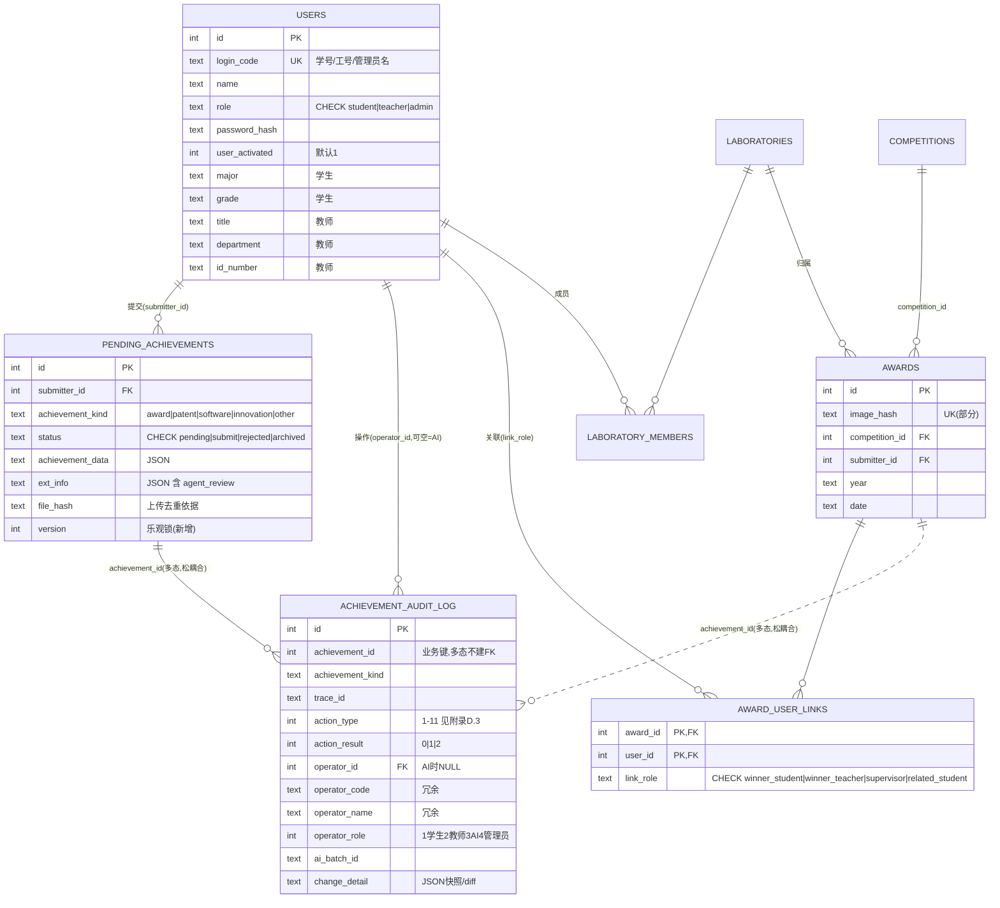

# AwardIE-AgentFlow 数据库设计（SDD·第二章）

| 项目 | 内容 |
| --- | --- |
| **文档版本** | v1.3 |
| **编写日期** | 2026-08-17 |
| **依据文档** | 需求文档 v1.8（8.5/8.6/5.4/7.2·7.4/1.7 取舍 D1-D5 / **2.0.3 业务规则 BR-3 成果归属** / 交叉审查 CR-7/8） |
| **可执行性声明** | 本章 DDL 均为 SQLite 方言、可直接执行；配套脚本见 `2026-08-14_数据库迁移脚本.sql` |
| **生效标注** | 每节标题标注【立即生效·阶段一/二】或【阶段三生效】，对齐 8.4 回滚策略 |

---

## 1. 设计总则

| # | 规范 | 说明 | 依据 |
| --- | --- | --- | --- |
| G1 | **连接契约强制** | 所有连接经 `get_connection()`，执行 `PRAGMA foreign_keys=ON; journal_mode=WAL; busy_timeout=30000`；禁止裸 `sqlite3.connect`（CI 静态检查 grep） | P0-4/5/7 |
| G2 | **时间格式** | 新表统一 ISO8601 TEXT（`DEFAULT CURRENT_TIMESTAMP` 兼容存量）；存量表日期列在阶段三数据治理时统一 | P2-3 |
| G3 | **枚举即 CHECK** | 一切状态/类型列必须 `CHECK(col IN (...))`；英文小写枚举，中文仅展示层 | P2-3/P2-14 |
| G4 | **引用完整性** | 用户侧引用一律 `REFERENCES users(id)`（阶段三起）；跨成果多态引用不建 FK、必须冗余 `*_kind` 标注 | 8.5.3 |
| G5 | **流水表 append-only** | `achievement_audit_log` 无 UPDATE/DELETE 路径；`review_logs` 冻结只读 | 8.6.5 |
| G6 | **SQLite 改表约束** | SQLite 不支持 ALTER 修改约束——凡涉及约束变更一律走"建新表 → INSERT SELECT → DROP → RENAME"，全程单事务包裹、脚本幂等（`IF NOT EXISTS` + `WHERE NOT EXISTS`） | 8.4 |
| G7 | **软删除语义** | pending 走状态机（`archived`/`rejected`），**不引入通用 deleted_at**——成果生命周期本身即软删除；字典表（competitions）用 `enabled` 标志 | 5.2 / D-4 |
| G8 | **字段类型规范（2026-08-19 新增）** | 短字段（标识/姓名/角色/路径/哈希等）一律 `VARCHAR(N)` 表达长度语义，长文本（ocr_text/description/JSON 字段等）才用 TEXT——当前存量 21 表 100+ 短字段误用 TEXT，映射见《2026-08-19_字段类型规范映射表》；随 ORM 化（M1 后半）全表重建时一次性落地，不单独迁移 | 企业标准/可移植性 |

---

## 2. 目标实体关系图（阶段三终态）



> 虚线（`||..o{`）表示多态松耦合引用（不建 FK，应用层校验 + kind 冗余）——依据 8.5.3：`achievement_id` 指向 5 张成果表 + 2 张实验室文件表，本质多态。

---

## 3. 立即生效 Schema【阶段一/二】

### 3.1 awards 补索引（P1-7）

```sql
-- 可直接执行（幂等）
CREATE INDEX IF NOT EXISTS idx_awards_competition  ON awards(competition_id);
CREATE INDEX IF NOT EXISTS idx_awards_submitter    ON awards(submitter_type, submitter_id);
CREATE INDEX IF NOT EXISTS idx_awards_laboratory   ON awards(laboratory_id) WHERE laboratory_id IS NOT NULL;
CREATE INDEX IF NOT EXISTS idx_awards_date         ON awards(date);
CREATE INDEX IF NOT EXISTS idx_awards_abnormal     ON awards(is_abnormal) WHERE is_abnormal = 1;
-- 去重护栏（P0-9）：部分唯一索引——image_hash 非空时唯一
CREATE UNIQUE INDEX IF NOT EXISTS uk_awards_image_hash ON awards(image_hash) WHERE image_hash IS NOT NULL AND image_hash != '';
```

> **注意**：`uk_awards_image_hash` 创建前必须先清理存量重复（见迁移脚本 §1.3，按 created_at 保留最早一条）。

### 3.2 四张 award_* 关联表重建（P1-12）——建新替旧，DISTINCT 去重

以 `award_student_winners` 为例（其余三张同构，脚本 §1.2 全量给出）：

```sql
BEGIN IMMEDIATE;
CREATE TABLE IF NOT EXISTS award_student_winners_new (
    award_id   INTEGER NOT NULL REFERENCES awards(id)      ON DELETE CASCADE,
    student_id INTEGER NOT NULL REFERENCES students(id)    ON DELETE CASCADE,  -- 阶段三改 REFERENCES users(id)
    created_at TEXT DEFAULT CURRENT_TIMESTAMP,
    PRIMARY KEY (award_id, student_id)
);
INSERT OR IGNORE INTO award_student_winners_new (award_id, student_id)
    SELECT DISTINCT award_id, student_id FROM award_student_winners
    WHERE award_id IN (SELECT id FROM awards)
      AND student_id IN (SELECT id FROM students);   -- 顺带清洗孤儿
DROP TABLE IF EXISTS award_student_winners;
ALTER TABLE award_student_winners_new RENAME TO award_student_winners;
COMMIT;
```

### 3.3 审核留痕表 achievement_audit_log（8.6.1 定稿 DDL）

```sql
CREATE TABLE IF NOT EXISTS achievement_audit_log (
    id               INTEGER PRIMARY KEY AUTOINCREMENT,
    achievement_id   INTEGER NOT NULL,
    achievement_kind TEXT CHECK(achievement_kind IN ('award','patent','software','innovation','other')),
    trace_id         TEXT,
    action_type      INTEGER NOT NULL CHECK(action_type BETWEEN 1 AND 11),
    action_result    INTEGER NOT NULL DEFAULT 0 CHECK(action_result IN (0,1,2)),
    operator_id      INTEGER REFERENCES users(id),   -- 阶段三前无 users 表则先去约束建列，见脚本§1.4说明
    operator_code    TEXT NOT NULL,
    operator_name    TEXT NOT NULL,
    operator_role    INTEGER CHECK(operator_role IN (1,2,3,4)),
    operator_ip      TEXT,
    ai_batch_id      TEXT,
    change_detail    TEXT,                            -- JSON
    remark           TEXT,
    created_at       TEXT DEFAULT CURRENT_TIMESTAMP
);
CREATE INDEX IF NOT EXISTS idx_audit_achievement ON achievement_audit_log(achievement_id, created_at);
CREATE INDEX IF NOT EXISTS idx_audit_trace       ON achievement_audit_log(trace_id) WHERE trace_id IS NOT NULL;
CREATE INDEX IF NOT EXISTS idx_audit_action      ON achievement_audit_log(action_type);
```

> operator 引用说明：阶段二建表时 `operator_id` 暂不加 FK（users 表尚不存在），语义上先存**旧表 PK**；阶段三 users 合并时随 `old_user_map` 统一重写并补 FK——避免二次重建。

### 3.4 pending_achievements 状态机扩展 + 乐观锁（P1-14/15、FR-APPROVE-07、8.6 软归档）

SQLite 无法 ALTER 加 CHECK，走重建（脚本 §1.5），关键变更列：

```sql
-- 新表核心差异（完整列沿用原表，此处仅列变更）：
--   status    TEXT NOT NULL DEFAULT 'pending'
--            CHECK(status IN ('pending','submit','rejected','archived'))
--   version   INTEGER NOT NULL DEFAULT 1          -- 乐观锁
--   review_time 仅在状态/审核人真实变更时由服务层写入（P3-12）
```

**状态转换守卫由服务层以条件更新实现**（设计契约，防 P1-15 TOCTOU）：

```python
# ReviewService 统一签名：转换必须带期望状态
def _transition(self, conn, pending_id, expected: str, to: str) -> bool:
    cur = conn.execute(
        "UPDATE pending_achievements SET status=?, version=version+1 "
        "WHERE id=? AND status=? AND version=?", (...))  # rowcount==0 即竞态失败，返回 False 上层报 3001
```

### 3.5 admin submitter_id 类型 bug 修复（P1-11）

```sql
-- 现状：innovation_projects.submitter_id 存字符串 'admin'（列定义 INTEGER）
-- 阶段一先做数据语义修复（不建 users 时用占位映射 0，脚本 §1.6）；阶段三并入 old_user_map 重写
UPDATE innovation_projects SET submitter_id = 0 WHERE submitter_type='admin' AND submitter_id='admin';
```

### 3.6 vocab 统一（P2-14）

```sql
UPDATE awards SET granted_role='student' WHERE granted_role='学生';
UPDATE awards SET granted_role='teacher' WHERE granted_role='教师';
-- 应用层同步：展示处做映射；DDL 层阶段三为 awards 补 CHECK(granted_role IN ('student','teacher'))
```

---

## 4. 阶段三生效 Schema【重构】

### 4.1 users 单表继承（8.5.1 定稿）

```sql
CREATE TABLE IF NOT EXISTS users (
    id              INTEGER PRIMARY KEY AUTOINCREMENT,
    login_code      TEXT UNIQUE,
    name            TEXT NOT NULL,
    role            TEXT NOT NULL CHECK(role IN ('student','teacher','admin')),
    password_hash   TEXT,
    user_activated  INTEGER NOT NULL DEFAULT 1 CHECK(user_activated IN (0,1)),
    phone TEXT, qq TEXT, skills TEXT,
    profile_is_public INTEGER DEFAULT 1,
    created_at TEXT DEFAULT CURRENT_TIMESTAMP,
    updated_at TEXT DEFAULT CURRENT_TIMESTAMP,
    major TEXT, grade TEXT,                    -- 学生
    title TEXT, department TEXT, id_number TEXT -- 教师
);
CREATE INDEX IF NOT EXISTS idx_users_role ON users(role);
CREATE INDEX IF NOT EXISTS idx_users_login_code ON users(login_code);
```

### 4.2 迁移映射表 old_user_map（ID 冲突重写的唯一依据）

```sql
CREATE TABLE IF NOT EXISTS old_user_map (
    old_role    TEXT NOT NULL CHECK(old_role IN ('student','teacher','admin')),
    old_id      INTEGER NOT NULL,
    new_user_id INTEGER NOT NULL REFERENCES users(id),
    PRIMARY KEY (old_role, old_id)
);
```

**引用重写范围**（事务内逐表 UPDATE，脚本 §2.3）：awards/patents/software_copyrights/other_files/innovation_projects/pending_achievements 的 `submitter_id`；review_logs 的 `submitter_id/reviewer_id`（`reviewer_type='system'` 置 NULL + `is_system_review=1`）；audit_log 的 `operator_id`；四张关联表 + laboratory_* 的 user 侧列。

**过渡兼容**：旧三表改为只读视图（`CREATE VIEW students AS SELECT ... FROM users WHERE role='student'`），观察一个迭代后 DROP（8.5.7 P2）。

### 4.3 award_user_links（关联表合并，8.5.4）

```sql
CREATE TABLE IF NOT EXISTS award_user_links (
    award_id  INTEGER NOT NULL REFERENCES awards(id) ON DELETE CASCADE,
    user_id   INTEGER NOT NULL REFERENCES users(id)  ON DELETE CASCADE,
    link_role TEXT NOT NULL CHECK(link_role IN ('winner_student','winner_teacher','supervisor','related_student')),
    created_at TEXT DEFAULT CURRENT_TIMESTAMP,
    PRIMARY KEY (award_id, user_id, link_role)
);
-- 数据搬迁：四张重建后的关联表 UNION ALL 进来（link_role 按来源表映射），验收后 DROP 旧表
```

### 4.4 统一成果视图 v_achievements（8.5.2，跨表查询不合并物理表）

```sql
CREATE VIEW IF NOT EXISTS v_achievements AS
SELECT id,'award' kind,title,NULL biz_no,submitter_id,laboratory_id,date business_date FROM awards
UNION ALL SELECT id,'patent',patent_name,application_number,submitter_id,laboratory_id,application_date FROM patents
UNION ALL SELECT id,'software',software_name,registration_number,submitter_id,laboratory_id,registration_date FROM software_copyrights
UNION ALL SELECT id,'innovation',project_name,project_no,submitter_id,laboratory_id,start_date FROM innovation_projects
UNION ALL SELECT id,'other',file_name,file_path,submitter_id,laboratory_id,NULL FROM other_files;
```

### 4.5 成果表业务键唯一约束（P0-9 根治）

```sql
CREATE UNIQUE INDEX IF NOT EXISTS uk_patents_application_no   ON patents(application_number) WHERE application_number IS NOT NULL;
CREATE UNIQUE INDEX IF NOT EXISTS uk_softwares_registration   ON software_copyrights(registration_number) WHERE registration_number IS NOT NULL;
-- 服务层入库改用 INSERT ... ON CONFLICT DO NOTHING + 查询返回已存在记录（幂等入库）
```

---

## 5. 归档冷库设计【阶段四】（需求 4.8 / 5.4）

| 项 | 设计 |
| --- | --- |
| 冷库文件 | `database/awards_archive.db`，结构与主库 awards + 关联表子集一致（同 DDL 建表） |
| 触发条件 | `award_date < date('now','-3 year')` 且已入库；由 APScheduler 每日任务执行 |
| 归档事务 | 冷库连接 `ATTACH` 主库 → 单事务 `INSERT OR IGNORE INTO archive SELECT ... WHERE 条件` → 校验计数一致 → 主库 `DELETE`（对应关联表 CASCADE） |
| 一致性校验 | 归档后比对两侧 `COUNT(*)/SUM(id)`，不一致即整体回滚并告警（指标 `archive_job_success`） |
| 查询路由 | 服务层"我的成果（含历史）"改查冷热 UNION 视图；审核/统计默认仅主库（热数据） |
| 回滚 | 归档 30 天内保留主库软删除标记（`archived_at` 列），支持反向回灌 |

---

## 6. 关键决策论证摘要

| 决策 | 结论 | 依据（实测数据） | 放弃方案及原因 |
| --- | --- | --- | --- |
| users 形态 | **单表继承** | users∩teachers 11 列重合；总用户 ≈1832；角色特有列 3+4 | 主表+角色子表：需 JOIN，收益仅列紧凑，规模不支持 |
| 成果主表 | **5 张物理表保留 + v_achievements 视图** | 字段差异大、各有 CHECK/UNIQUE（申请号/登记号语义不同） | 单宽表：大量稀疏列、UNIQUE 语义破坏 |
| audit_log 对 achievement_id | **不建 FK，多态 + kind 冗余** | 指向 7 张目标表（5 成果 + 2 实验室文件） | 间接实体表：多一层 JOIN，代价>收益（8.5.3） |
| 软删除 | **状态机（archived/rejected），不设 deleted_at** | 成果生命周期天然覆盖；字典表用 enabled | 通用 deleted_at 与状态机语义冲突、查询需全局过滤 |
| reviewer 的 system | **reviewer_id 可空 + is_system_review 标志** | system 占 71%（1380 条），非用户实体 | 假 system 用户行：污染 users、login_code 无值 |

> **业务规则对齐（SRS 2.0.3，v1.3）**：BR-3"成果归属以证书载明获奖人为准、获奖人须在学生名册内"——落点为 §3.1 去重护栏 + §3.2/§4.3 关联表 FK（award_user_links 仅可关联 users 内成员），归属校验在服务层提交时执行；BR-1"级别认定以管理员白名单为唯一口径"——RAG 检索仅为辅助参考，不作认定依据。

---

## 7. 迁移路线图（对齐 8.4，脚本章节号对应 `2026-08-14_数据库迁移脚本.sql`）

| 阶段 | 脚本节 | 内容 | 回滚方式 |
| --- | --- | --- | --- |
| **P0 低风险（随阶段一/二发布）** | §1 | 索引（§1.1）、关联表重建去重（§1.2）、awards 重复清洗 + 唯一索引（§1.3）、audit_log 建表（§1.4）、pending 状态机重建（§1.5）、admin bug + 词汇（§1.6） | 迁移前全量冷备份 `.bak.<date>`；脚本全部幂等可重放；失败事务整体回滚 |
| **P1 核心（阶段三， Feature Flag 灰度）** | §2 | users 建表 + old_user_map + 三表搬迁（§2.1/2.2）→ 全量引用重写（§2.3）→ **每日对账脚本 N 天**（CR-7：行数 + 抽样字段比对 + old_user_map 完整性断言——注意须在旧三表转视图**之前**执行，转视图后"新旧双读"比对的是同一数据的两种投影、恒等不构成校验）→ 稳定后旧三表转视图（§2.4） | Flag 一键切回旧 Manager 路径；映射表保留可逆推 |

> **2026-08-19 补充（M1 后半/ORM 化合并项）**：①引用重写**数据层已完成**（10 表 submitter_id→users.id 零悬空，路径 A 桥接）；②ORM 化迁移（SQLAlchemy 首次全表重建）时**一并落地字段类型规范**（G8，映射表 `2026-08-19_字段类型规范映射表.md`），避免两次重建；③保留 is_valid 生成列、awards 唯一索引、关联表 FK。
| **P2 收尾（观察一个迭代后）** | §3 | DROP 旧三表、合并 award_user_links、成果表唯一约束、词汇 CHECK | 同 P1（此前未 DROP，视图可反向重建） |

> **验证方式**（每步内置断言，失败即中止）：`PRAGMA foreign_key_check` 为空；`SELECT COUNT(*)` 搬迁前后一致；唯一索引创建成功即证明无重复；对账脚本连续 N 天零差异。
>
> **迁移工具交接点（CR-8）**：阶段三引入 Flask-Migrate 后，以当期 schema 打 baseline（`flask db stamp head`），此后增量迁移一律走 Alembic；本手写脚本归档为历史基线，不再更新。

---

> **本章验收**：①脚本在**空库**与**生产副本**各执行一遍均幂等成功；②`foreign_key_check` 空；③audit_log/review_logs 计数与业务操作一致（9.1 留痕验收）；④归档演练一次成功回滚一次。
