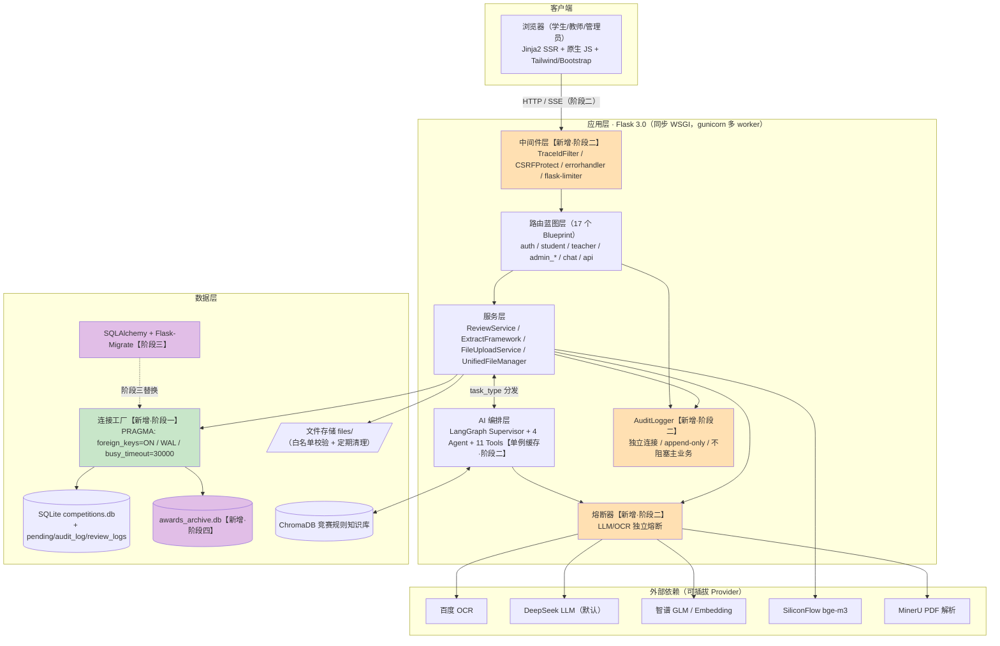

# AwardIE-AgentFlow 系统架构设计（SDD·第一章）

| 项目 | 内容 |
| --- | --- |
| **文档版本** | v1.3 |
| **编写日期** | 2026-08-17 |
| **依据文档** | 《需求分析文档》v1.8（v1.3：依据刷新至 v1.8——业务需求 2.0 / 根因复盘 7.5 / P0-1·P0-2 移除） |
| **设计范围** | 总体架构 + 分层契约 + 关键决策论证 + 四阶段演进 |
| **决策依据标注** | 引用需求文档 issue ID（如 P0-4）与 FR ID（如 FR-AUDIT-01） |

---

## 1. 系统总体架构（C4·Container 层级）

> 橙色为阶段二新增组件，绿色为阶段一新增，紫色为阶段三/四演进项。**分层不变量：路由层不直接触碰 sqlite3 连接（P2-1），AI 编排层不直接触碰业务库（经 ToolContext 只读）。**

---

## 2. 分层职责与接口契约

### 2.1 路由蓝图层（Web）

| 维度 | 设计 |
| --- | --- |
| **职责** | 参数解析与 Pydantic 校验、鉴权装饰器（require_user_type / require_role_api）、调用服务层、组装响应 `{trace_id, code, message, data}`、触发 AuditLogger |
| **不做** | 业务规则判断、SQL、LLM 调用、文件系统直接操作 |
| **接口契约（入）** | HTTP + FormData/JSON；所有写操作须携带 CSRF Token（P1-1） |
| **接口契约（出）** | 统一响应包装 + 错误码 1xxx-5xxx（见第三章 3.2）；SSE 端点除外（事件流协议见 3.6） |
| **部署约束** | 与应用层同进程，不可独立部署；gunicorn sync worker ×N（N=CPU×2+1） |

### 2.2 服务层（Service）

| 维度 | 设计 |
| --- | --- |
| **职责** | 审核状态机转换（唯一写入口，含 status 守卫与乐观锁，P1-14/15）、成果入库去重（P0-9）、文件生命周期管理（P1-9）、事务边界持有者（多步写单事务，P1-8） |
| **不做** | HTTP 语义、Agent 编排细节 |
| **接口契约** | 入参/出参统一 dataclass/Pydantic（P2-13：边界层 Pydantic，内部 dataclass）；状态转换函数签名统一为 `fn(pending_id, operator, expected_status) -> Result`，内部执行 `UPDATE ... WHERE id=? AND status=?` 并校验 rowcount（P1-15 乐观锁） |
| **部署约束** | 同进程；**禁止再起后台线程共享 Manager**（P1-16：异步归档改为同步或经队列） |

### 2.3 AI 编排层（LangGraph）

| 维度 | 设计 |
| --- | --- |
| **职责** | 意图路由（Supervisor）、抽取/审核/问答/工具四类任务编排、RAG 检索（统一 retrieve()，P2-6/23）、熔断降级决策 |
| **不做** | 业务库写入（ToolContext 只读）、HTTP |
| **接口契约** | 入：`AgentRequest{task_type, file_path?, message?, trace_id, user_ctx}`；出：`AgentResult{answer?, extraction?, review?, sources[], steps[]}`；所有 LLM 调用必经熔断器包装（timeout=30s / max_retries=3，P1-6） |
| **生命周期** | **进程级单例**（阶段二）：首次请求惰性编译 StateGraph，之后复用（P1-5）；ToolContext 同为全局单例 |
| **部署约束** | 同进程；LLM 为阻塞 IO，依赖 timeout+熔断保护 worker（见 D-1 风险） |

### 2.4 数据层

| 维度 | 设计 |
| --- | --- |
| **职责** | 持久化与缓存（SQLite ×3 + Chroma + 文件）；连接契约强制（P0-4/5/7） |
| **不做** | 业务逻辑（Manager 退化为纯 DAO，阶段三被 SQLAlchemy Repository 替代） |
| **接口契约** | 唯一入口 `get_connection(db_path)`：`PRAGMA foreign_keys=ON; journal_mode=WAL; busy_timeout=30000`；**禁止任何裸 `sqlite3.connect`**（静态检查见 9.5） |
| **部署约束** | 单机单写者；归档冷库 `awards_archive.db` 与主库同机（阶段四，见第二章 5） |

### 2.5 外部依赖层

| Provider | 用途 | 失败策略 |
| --- | --- | --- |
| 百度 OCR | 高精度 OCR | 链式降级→智谱→RapidOCR；熔断 5 次失败/60s（P1-10） |
| DeepSeek/智谱 | LLM 抽取/对话 | timeout=30s + 3 次指数退避（P1-20）+ 熔断；降级="仅 OCR 文本，LLM 标记待人工"（FR-CHAT 降级） |
| SiliconFlow | Embedding | timeout + 重试（P2-21）；失败时 RAG 节点跳过并提示 |
| MinerU | PDF 解析 | 失败回退 PyMuPDF |

---

## 3. 关键设计决策论证（决策驱动）

> 每项决策：背景（引用需求文档证据）→ 决策 → 正向收益 / 潜在风险 → 缓解措施。

### D-1　保持 Flask 同步架构，不迁移 FastAPI/异步

- **背景**：性能短板实测为「每请求重建工作流」（P1-5）与「LLM 无超时阻塞」（P1-6、P1-20），**瓶颈在初始化开销与外部 IO 无保护，而非框架本身**；并发目标仅 20 用户（9.2 DoD）。
- **决策**：保留 Flask + gunicorn sync worker；通过「工作流单例 + timeout/重试/熔断 + WAL/busy_timeout」满足 DoD，而非更换框架。
- **正向收益**：79,570 行 Python 与 79 个模板零迁移成本；团队心智负担为零；改造集中在中间件层。
- **潜在风险**：SSE 长连接（P2-4）会长期占用一个 sync worker；LLM 长阻塞场景 worker 利用率低。
- **缓解**：SSE 走**独立 gunicorn 实例**（部署设计 app-sse 服务，nginx 按 `/assistant/chat/stream` 路径分流——gunicorn worker 隶属单一 master，无按路由分池能力，CR-5 修正原表述）；每用户 SSE 并发连接数限制（CR-6）；熔断+30s 超时保证 worker 最坏占用有上界；**预留 Celery/RQ 异步队列接口**（服务层签名不依赖请求上下文），阶段四如并发增长可平滑引入。

### D-2　止血阶段保留 SQLite，不立即迁移 MySQL/PostgreSQL

- **背景**：数据库三大 P0（P0-4 外键未启用、P0-5 无 WAL、P0-7 busy_timeout 缺位）修的是**运行时契约**，与数据库产品无关；数据量实测 awards 197 行、年增数百，远未触及 SQLite 容量瓶颈；8.4 明确"禁止一次性切到底"。
- **决策**：阶段一~三 继续 SQLite + 连接工厂契约；阶段三 ORM 化（SQLAlchemy）后，切换 MySQL/PG 仅是连接串变更（ORM 已隔离方言），作为阶段四**可选**演进。
- **正向收益**：零停机迁移风险；修复聚焦真问题（约束/索引/事务）而非"换库"。
- **潜在风险**：单写者模型限制写并发上限（约数百 TPS）；单机无 HA。
- **缓解**：WAL + busy_timeout=30000 覆盖 20 并发 DoD；归档冷库（第二章 5）控制主库体积；写入热点集中在审核动作（低频人工操作）。

### D-3　AI 编排保持 Supervisor 动态路由，不改为静态 DAG

- **背景**：审核链路存在**运行时才知道的分支**：auto 模式按意图分类路由（supervisor.py:112 `_llm_route`）、AI 把关可能转人工（reject/need_manual 分支）、工具调用结果决定是否追加检索。静态 DAG 需预先枚举全部路径，无法表达"AI 审核不通过→追加人工节点"这类条件闭环。
- **决策**：保留 Supervisor 模式（START→supervisor→{extraction/review/qa/tools}→supervisor 循环），阶段二叠加**工作流单例缓存**（P1-5）。
- **正向收益**：新增能力只需注册节点；与现有 11 个 Tool 兼容；recursion_limit=50 + steps 去重已防失控（FR-REVIEW-04）。
- **潜在风险**：单例后 State 必须无共享可变状态（并发请求共用 graph 对象）。
- **缓解**：LangGraph 设计上 invoke 时传入独立 State（`TypedDict total=False`），单例仅缓存编译产物；约束：**节点函数禁止写模块级全局变量**（纳入代码评审清单）。

### D-4　留痕与日志采用"旁路"架构（AuditLogger 独立连接）

- **背景**：FR-AUDIT-04 要求留痕失败不阻塞主业务；若 audit 写入与主业务同事务，日志失败会回滚业务，与需求冲突。
- **决策**：AuditLogger 独立连接 + 独立事务 + try/except 吞异常（仅 warning）；audit_log 为 append-only，无 update/delete。
- **正向收益**：主链路可用性不受审计影响；append-only 天然防篡改。
- **潜在风险**：best-effort 意味着极端情况漏记（已在需求文档 8.6.3 显式声明该权衡）。
- **缓解**：写失败记录进本地重试队列文件（阶段二可选）；业务黄金指标含 `audit_write_success_rate`（4.7），漏记可观测。

---

## 4. 四阶段架构演进时序

```mermaid
flowchart LR
    subgraph S1["阶段一·止血（1-2天）"]
        A1["连接工厂<br/>PRAGMA三契约"]
        A2["关闭debug RCE"]
        A3["CSRF+强密钥+改密"]
        A4["上传白名单+2GB收紧"]
        A5["去竖图旋转"]
        A6["种子数据"]
    end
    subgraph S2["阶段二·加固（3-5天）"]
        B1["工作流单例"]
        B2["熔断器+timeout"]
        B3["AuditLogger<br/>+audit_log表"]
        B4["errorhandler<br/>+trace_id"]
        B5["索引+乐观锁<br/>status守卫"]
        B6["审核驳回路由重开"]
    end
    subgraph S3["阶段三·重构（1-2周）"]
        C1["SQLAlchemy<br/>+Flask-Migrate"]
        C2["users三表合并<br/>多态外键消除"]
        C3["全表缓存去除"]
        C4["JSON提列+CHECK"]
        C5["SSE流式"]
        C6["路由去重"]
    end
    subgraph S4["阶段四·工程化（1周）"]
        D1["Docker+CI"]
        D2["监控告警<br/>Prometheus"]
        D3["归档冷库+清理调度"]
        D4["依赖锁+安全扫描"]
        D5["擦除权+脱敏"]
    end
    S1 --> S2 --> S3 --> S4
```

**演进不变量**（每阶段结束时必须仍成立）：
1. 主业务链路（上传→抽取→审核→入库）全流程可用；
2. 每阶段交付可独立回滚（8.4：Feature Flag / 备份 / 影子读）；
3. 老数据零丢失——users 合并期间旧三表以只读视图并存（8.5.7 P1→P2 过渡）。

---

## 5. 架构假设与约束

| # | 假设/约束 | 依据 | 若假设破裂的应对 |
| --- | --- | --- | --- |
| A1 | 并发 ≤20 用户（院系规模） | 9.2 DoD | 阶段四引入队列/换库（D-1/D-2 已预留） |
| A2 | 用户信任边界为"登录用户"与"访客（只读门户）"，无公网匿名写 | 2.2 权限矩阵 / 1.7 取舍 D1 | `/files/laboratories` 下载区**改登录可见**；公开面仅剩门户只读图片接口（强制 attachment + 白名单，FR-PORTAL-05）；任何上传路径禁止公开 inline 渲染（P0-10） |
| A3 | AI 外部服务可用性 ≥99%/月 | 经验值 | 熔断+降级链保证"OCR-only"模式可用（P1-10） |
| A4 | 单机部署（无集群） | run.sh 现状 | 数据层无分布式假设，扩容=换更强单机+冷热分离 |

---

> **本章验收方式**：①架构图与代码目录一一对应（评审走查）；②D-1~D-4 每条决策的风险缓解项在对应阶段任务表中存在落地任务（8.2 对照）；③四阶段不变量纳入 CI 冒烟用例。
