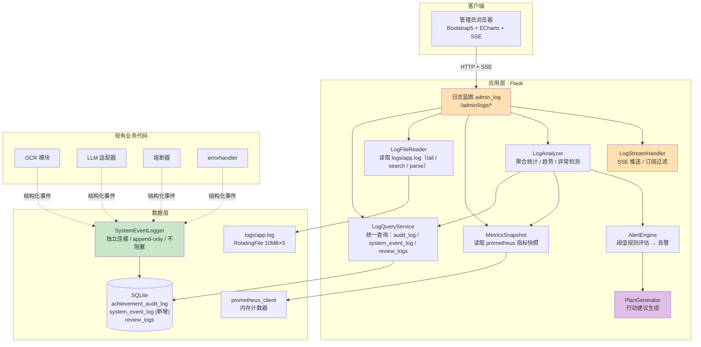

# AwardIE-AgentFlow 日志系统设计（SDD·第八章）

| 项目 | 内容 |
| --- | --- |
| **文档版本** | v1.0 |
| **编写日期** | 2026-08-19 |
| **依据文档** | 需求文档 v1.8（7.4 问题清单 / 8.2 路线图 / 4.7 业务指标 / 9.1 DoD）；部署运维设计 v1.3 §3-§4（监控指标 / 日志规范）；安全设计 v1.2 §4（日志注入防护）；数据库设计 v1.2 §3.3（audit_log DDL） |
| **设计范围** | 管理员日志查看 + 统计分析 + 自动建议 + 实时流 + 行动计划生成 |
| **决策依据标注** | 引用 SRS issue ID（如 P1-13 留痕）与 FR ID（如 FR-ADMIN-01 管理员功能） |

---

## 1. 现状与目标

### 1.1 现状画像

| 日志源 | 介质 | 结构化 | 可查询 | 管理后台界面 | 核心问题 |
| --- | --- | --- | --- | --- | --- |
| `achievement_audit_log` 表 | SQLite | 高（11 动作 / 4 角色 / JSON diff） | 高（3 索引） | 无 | 管理员无法在后台查看，只能直查 DB |
| `logs/app.log` 文件 | 文件系统 | 低（纯文本） | 低（需 grep） | 无 | 格式缺 trace_id（设计文档要求但未落地）；多 worker 下分散 |
| Prometheus 指标（metrics.py） | 内存 → `/api/metrics` | 高（6 指标） | 高（已暴露） | 无 | 只有快照值，无历史趋势可视化 |
| `review_logs` 表 | SQLite | 高（3 动作） | 高 | 无 | 与 audit_log 信息重叠；SRS M4 计划冻结停写 |

**核心差距**：四套日志机制各自独立运行，管理员没有任何统一查看/分析入口，只能 SSH 到服务器用命令行工具看文件或直查数据库。

### 1.2 设计目标

| 目标 | 验收标准 |
| --- | --- |
| 管理员可在后台查看全部日志 | audit_log / app.log / metrics / system_event_log 四源统一界面 |
| 实时日志流 | SSE 推送，延迟 ≤2s，管理员可订阅过滤 |
| 统计分析看板 | 6+ 图表（动作分布 / 错误趋势 / 审核瓶颈 / 活跃度 / 熔断状态 / 留痕成功率） |
| 自动建议与行动计划 | 基于阈值规则自动生成告警 + 行动建议，管理员可确认/忽略/派发 |
| 结构化事件归档 | 新增 `system_event_log` 表，OCR 失败/熔断翻转/异常捕获自动入库 |
| 补齐 trace_id | run.py 日志格式对齐部署设计 §4 规范 |

### 1.3 非目标

- 不引入 ELK/Loki 等外部日志收集系统（当前 SQLite 单机可接受，T16 数据库迁移后重估）
- 不做日志采集 Agent 或 Filebeat（直接读文件 + DB 查询）
- 不替换现有 AuditLogger（append-only 契约不变，只增加查询层）
- 不引入独立 Prometheus server（用快照轮询 + DB 归档替代时序存储）

---

## 2. 系统架构



> 橙色为新增路由/组件，绿色为新增数据写入层，紫色为行动计划生成。**分层不变量：日志查询层只读，不触碰业务写入路径；SystemEventLogger 复用 AuditLogger 的独立连接/不阻塞模式。**

---

## 3. 数据层设计

### 3.1 新增表：system_event_log

将应用层关键事件（OCR 失败、熔断翻转、异常捕获、认证失败等）从非结构化的 app.log 升级为结构化 DB 记录，使其可查询、可聚合。

```sql
CREATE TABLE IF NOT EXISTS system_event_log (
    id              INTEGER PRIMARY KEY AUTOINCREMENT,
    event_category  TEXT NOT NULL CHECK(event_category IN (
                        'ocr', 'llm', 'breaker', 'auth', 'upload',
                        'db', 'security', 'system')),
    event_level     TEXT NOT NULL CHECK(event_level IN (
                        'debug', 'info', 'warning', 'error', 'critical')),
    event_message   TEXT NOT NULL,
    trace_id        TEXT,
    operator_id     INTEGER REFERENCES users(id),
    operator_code   TEXT,
    detail          TEXT,          -- JSON: provider / model / error_type / stack_trace 等
    source_module   TEXT,          -- logger name (如 backend.ocr.baidu_adapter)
    source_file     TEXT,
    source_line     INTEGER,
    created_at      TEXT DEFAULT CURRENT_TIMESTAMP
);

CREATE INDEX IF NOT EXISTS idx_event_category   ON system_event_log(event_category, created_at);
CREATE INDEX IF NOT EXISTS idx_event_level       ON system_event_log(event_level, created_at);
CREATE INDEX IF NOT EXISTS idx_event_trace       ON system_event_log(trace_id) WHERE trace_id IS NOT NULL;
CREATE INDEX IF NOT EXISTS idx_event_time        ON system_event_log(created_at);
```

**设计约束**（与 AuditLogger 对齐）：

| 约束 | 说明 |
| --- | --- |
| append-only | 只 INSERT，无 UPDATE/DELETE 路径（G5 契约） |
| 不阻塞主业务 | 独立 sqlite3 连接 + try/except 全吞 + 失败仅 `logging.warning` |
| 容量控制 | 定时任务清理 90 天前记录（与 review_logs cleanup 对齐，部署 §6） |
| PII 脱敏 | 写入前经 `_sanitize()` 过滤身份证/手机号/完整学号（安全 §4 规范） |

### 3.2 ORM 模型

```python
# backend/orm/system_event_log.py
from sqlalchemy import Integer, Text, Text
from backend.orm.base import Base

class SystemEventLog(Base):
    __tablename__ = "system_event_log"
    id: Mapped[int] = mapped_column(Integer, primary_key=True, autoincrement=True)
    event_category: Mapped[str] = mapped_column(Text, nullable=False)
    event_level: Mapped[str] = mapped_column(Text, nullable=False)
    event_message: Mapped[str] = mapped_column(Text, nullable=False)
    trace_id: Mapped[Optional[str]] = mapped_column(Text)
    operator_id: Mapped[Optional[int]] = mapped_column(Integer, ForeignKey("users.id"))
    operator_code: Mapped[Optional[str]] = mapped_column(Text)
    detail: Mapped[Optional[str]] = mapped_column(Text)  # JSON
    source_module: Mapped[Optional[str]] = mapped_column(Text)
    source_file: Mapped[Optional[str]] = mapped_column(Text)
    source_line: Mapped[Optional[int]] = mapped_column(Integer)
    created_at: Mapped[str] = mapped_column(Text, default=func.now())
```

### 3.3 SystemEventLogger

```python
# backend/utils/system_event_logger.py
class SystemEventLogger:
    """复用 AuditLogger 设计模式：独立连接 / append-only / 不阻塞"""

    EVENT_CATEGORIES = {'ocr', 'llm', 'breaker', 'auth', 'upload', 'db', 'security', 'system'}

    @classmethod
    def log(cls, category, level, message, *,
            trace_id=None, operator=None, detail=None,
            source_module=None, source_file=None, source_line=None) -> bool:
        """写入一条系统事件。失败仅 warning，绝不抛异常。"""

    @classmethod
    def from_exception(cls, exc, category='system', **kwargs) -> bool:
        """从异常对象提取 message/traceback/source 自动填充"""
```

**接入点矩阵**：

| 事件类别 | 触发点 | 接入方式 |
| --- | --- | --- |
| ocr | baidu_adapter / other OCR adapters 失败 | try/except 内调用 `SystemEventLogger.log('ocr', 'error', ...)` |
| llm | llm_adapter 超时/重试耗尽/输出校验失败 | 同上 |
| breaker | CircuitBreaker 状态翻转 | `_on_state_change` 回调中调用 |
| auth | 登录失败 / CSRF 拒绝 / IDOR 403 | errorhandler + limiter 回调 |
| upload | 文件类型拒绝 / 超大 / 哈希重复 | FileUploadService 内调用 |
| db | 锁等待超时 / 外键违反 | 连接工厂异常捕获 |
| security | 裸 except 捕获 / 日志注入检测 | CI lint 门禁 + 运行时 |
| system | 启动/关闭/配置热更新 | app lifecycle hook |

### 3.4 迁移脚本

手写 Alembic 迁移 `0006_system_event_log.py`（遵循项目约定：禁用 autogenerate）：

```python
def upgrade():
    op.create_table('system_event_log', ...)
    # 4 个索引
def downgrade():
    op.drop_table('system_event_log')
```

---

## 4. 查询与分析层

### 4.1 LogQueryService

统一查询接口，封装多源日志的查询逻辑。

```python
# backend/services/log_query_service.py
class LogQueryService:
    """统一日志查询服务 — 只读，不触碰写入路径"""

    @staticmethod
    def query_audit_logs(*, page=1, per_page=50, action_type=None,
                         operator_role=None, achievement_id=None,
                         trace_id=None, start_date=None, end_date=None) -> dict:
        """查询 achievement_audit_log，返回 {items, total, page, per_page}"""

    @staticmethod
    def query_system_events(*, page=1, per_page=50, category=None,
                           level=None, trace_id=None,
                           start_date=None, end_date=None) -> dict:
        """查询 system_event_log"""

    @staticmethod
    def query_review_logs(*, page=1, per_page=50, action_type=None,
                          reviewer_id=None, submitter_id=None,
                          start_date=None, end_date=None) -> dict:
        """查询 review_logs（交叉引用补充）"""

    @staticmethod
    def query_all(*, source='all', **filters) -> dict:
        """跨源统一查询（audit + system_event），按时间合并排序"""
```

### 4.2 LogFileReader

读取和解析 `logs/app.log` 文件，提供实时 tail 和关键词搜索。

```python
# backend/services/log_file_reader.py
class LogFileReader:
    """应用日志文件读取器"""

    LOG_PATH = None  # 从 ConfigLoader 获取

    @classmethod
    def tail(cls, lines=100) -> list[dict]:
        """读取最后 N 行，解析为 {timestamp, level, logger, message}"""

    @classmethod
    def search(cls, keyword=None, level=None,
               start_time=None, end_time=None, limit=500) -> list[dict]:
        """关键词/级别/时间范围搜索"""

    @classmethod
    def stream(cls, filter_level=None, filter_keyword=None):
        """生成器：持续监控文件新增行（基于 seek position）"""
```

**解析正则**（对齐 run.py 格式）：

```python
LOG_PATTERN = re.compile(
    r'^(\d{4}-\d{2}-\d{2} \d{2}:\d{2}:\d{2}) - (\w+) \[([\w.]+)\] (.*)$'
)
```

**trace_id 补齐**（设计阶段落地）：run.py 的 formatter 增加一个 `TraceIdFilter`，在每条日志的 message 前自动注入 `[tid:xxxx]`（从 Flask g 对象取），LogFileReader 解析时提取。

### 4.3 MetricsSnapshot

读取 Prometheus 指标当前值并归档为时间序列。

```python
# backend/services/metrics_snapshot.py
class MetricsSnapshot:
    """Prometheus 指标快照采集 + 归档"""

    @staticmethod
    def collect() -> dict:
        """从 prometheus_client 读取所有指标当前值"""

    @staticmethod
    def archive():
        """定时采集快照写入 system_event_log（category='system'）
        或独立 metrics_snapshot 表，保留 30 天"""
```

**归档策略**：每 5 分钟采集一次快照（APScheduler 或 cron），存入 `system_event_log` 表（category='system', detail=JSON 指标快照），用于历史趋势图表。

### 4.4 LogAnalyzer

聚合统计引擎，为分析看板提供数据。

```python
# backend/services/log_analyzer.py
class LogAnalyzer:
    """日志统计分析引擎"""

    @staticmethod
    def action_distribution(start_date, end_date) -> dict:
        """审核动作分布（audit_log action_type 分组计数）"""

    @staticmethod
    def error_trend(days=7) -> list[dict]:
        """错误趋势（system_event_log level=error/warning 按日分组）"""

    @staticmethod
    def review_bottleneck() -> dict:
        """审核瓶颈分析（pending 平均等待时长 / 积压量 / 超时率）"""

    @staticmethod
    def user_activity(top_n=10) -> list[dict]:
        """活跃用户排行（audit_log operator 分组计数）"""

    @staticmethod
    def ai_health() -> dict:
        """AI 服务健康度（OCR/LLM 成功率 / 熔断状态 / 平均耗时）"""

    @staticmethod
    def audit_write_health() -> dict:
        """留痕成功率（metrics.audit_write_total 推算）"""

    @staticmethod
    def daily_summary(date) -> dict:
        """指定日期全量摘要（供每日报告推送）"""
```

### 4.5 AlertEngine

基于阈值的告警引擎。

```python
# backend/services/alert_engine.py
class AlertEngine:
    """阈值规则告警引擎"""

    RULES = [
        {
            'id': 'A001',
            'name': 'OCR 失败率突增',
            'metric': 'ocr_error_rate_1h',
            'threshold': 0.3,         # >30%
            'severity': 'warning',
            'message': 'OCR 失败率 {value:.0%}（阈值 {threshold:.0%}），检查 OCR Provider 状态',
            'action': '检查 ocr_runtime.json 禁用记录 / 切换备用 Provider',
        },
        {
            'id': 'A002',
            'name': '审核积压超限',
            'metric': 'pending_count_48h',
            'threshold': 20,          # >20 条等待超 48h
            'severity': 'warning',
            'message': '待审核积压 {value} 条（超 48h），建议增加审核人手',
            'action': '检查教师审核排班 / 评估 AI 自动审核覆盖率',
        },
        {
            'id': 'A003',
            'name': '熔断器 Open',
            'metric': 'breaker_state',
            'threshold': 2,            # ==2 (open)
            'severity': 'critical',
            'message': '熔断器 {name} 处于 Open 状态，AI 服务不可用',
            'action': '检查 LLM/OCR Provider 可用性 / 等待 cooldown 恢复',
        },
        {
            'id': 'A004',
            'name': '留痕写入失败率',
            'metric': 'audit_write_failure_rate_1h',
            'threshold': 0.01,        # >1%
            'severity': 'critical',
            'message': '审核留痕写入失败率 {value:.2%}（阈值 {threshold:.2%}）',
            'action': '检查 SQLite 锁竞争 / 审计日志表完整性',
        },
        {
            'id': 'A005',
            'name': '认证失败激增',
            'metric': 'auth_failure_count_5m',
            'threshold': 10,          # 5 分钟内 >10 次
            'severity': 'warning',
            'message': '认证失败 {value} 次/5min，可能暴力破解',
            'action': '检查 limiter 是否生效 / 封禁高频 IP',
        },
        {
            'id': 'A006',
            'name': 'DB 锁等待',
            'metric': 'db_locked_total',
            'threshold': 0,           # >0
            'severity': 'warning',
            'message': '数据库锁等待 {value} 次，可能并发写入冲突',
            'action': '检查 busy_timeout / 评估是否需迁 Redis 队列',
        },
    ]

    @staticmethod
    def evaluate() -> list[dict]:
        """评估所有规则，返回触发的告警列表"""

    @staticmethod
    def get_recent_alerts(days=7) -> list[dict]:
        """查询历史告警记录"""
```

**告警记录存储**：触发的告警写入 `system_event_log`（category='security' 或 'system', level=severity, detail=JSON 告警上下文），可在日志流中查看。

### 4.6 PlanGenerator

从分析结果和告警生成可执行的行动计划。

```python
# backend/services/plan_generator.py
class PlanGenerator:
    """行动计划生成器 — 基于分析结果和告警自动生成建议"""

    @staticmethod
    def generate() -> list[dict]:
        """生成当前行动计划列表，每条包含：
        - id: 计划项 ID
        - priority: high / medium / low
        - category: 安全 / 性能 / 业务 / 运维
        - title: 简述
        - description: 详细说明
        - evidence: 关联数据（告警 ID / 统计数据 / 日志条目）
        - suggested_actions: 建议操作列表
        - status: open / acknowledged / resolved
        - created_at
        """

    @staticmethod
    def from_alert(alert: dict) -> dict:
        """将单条告警转化为行动计划项"""

    @staticmethod
    def daily_report() -> dict:
        """生成每日报告摘要（供 metrics_daily_report 定时任务推送管理员）"""
```

**计划生成逻辑**：

| 输入 | 输出计划 |
| --- | --- |
| A001 OCR 失败率 >30% | 高优先 / 运维 / "检查 OCR Provider 禁用记录并切换备用引擎" |
| A002 审核积压 >20 | 中优先 / 业务 / "增加审核排班，评估 AI 自动审核覆盖率" |
| A003 熔断器 Open | 高优先 / 性能 / "检查 LLM Provider 可用性，等待 cooldown 恢复" |
| A004 留痕失败率 >1% | 高优先 / 安全 / "检查 SQLite 锁竞争和审计表完整性" |
| A005 认证失败激增 | 高优先 / 安全 / "检查 limiter 配置，封禁高频 IP" |
| A006 DB 锁等待 | 中优先 / 性能 / "检查 busy_timeout 配置，评估 Redis 迁移" |
| 审核瓶颈分析 | 低优先 / 业务 / "优化审核流程，缩短 pending 等待时长" |
| AI 健康度下降 | 中优先 / 性能 / "评估 LLM Provider 切换或降级策略" |

---

## 5. API 接口设计

### 5.1 总则

- 所有接口挂载在 `admin_log` 蓝图下，URL 前缀 `/admin`
- 鉴权：`@require_role_api_json('admin')` — 仅管理员可访问
- 响应：统一 `{trace_id, code, message, data}` 包装（API §1.1）
- CSRF：写操作须传 `X-CSRF-Token`
- 限流：查询接口 30 req/min（admin 角色），SSE 连接并发 ≤2

### 5.2 接口清单

| 方法 | 路径 | 功能 | 参数 |
| --- | --- | --- | --- |
| GET | `/admin/logs` | 日志管理页面（HTML） | — |
| GET | `/admin/api/logs/audit` | 审核留痕查询 | page, per_page, action_type, operator_role, achievement_id, trace_id, start_date, end_date |
| GET | `/admin/api/logs/system` | 系统事件查询 | page, per_page, category, level, trace_id, start_date, end_date |
| GET | `/admin/api/logs/review` | 审核日志查询 | page, per_page, action_type, reviewer_id, start_date, end_date |
| GET | `/admin/api/logs/app` | 应用日志文件查询 | keyword, level, start_time, end_time, limit |
| GET | `/admin/api/logs/app/tail` | 应用日志尾部 | lines (默认 100) |
| GET | `/admin/api/logs/stream` | SSE 实时日志流 | source (audit/system/app/all), level, keyword |
| GET | `/admin/api/logs/analysis/actions` | 动作分布统计 | start_date, end_date |
| GET | `/admin/api/logs/analysis/errors` | 错误趋势 | days (默认 7) |
| GET | `/admin/api/logs/analysis/bottleneck` | 审核瓶颈 | — |
| GET | `/admin/api/logs/analysis/activity` | 活跃用户 | top_n (默认 10) |
| GET | `/admin/api/logs/analysis/ai-health` | AI 服务健康 | — |
| GET | `/admin/api/logs/metrics` | 指标快照 | — |
| GET | `/admin/api/logs/alerts` | 当前告警 | — |
| GET | `/admin/api/logs/alerts/history` | 历史告警 | days (默认 7) |
| GET | `/admin/api/logs/plan` | 行动计划 | — |
| POST | `/admin/api/logs/plan/<id>/acknowledge` | 确认计划项 | — |
| POST | `/admin/api/logs/plan/<id>/resolve` | 标记已解决 | resolution_note |
| GET | `/admin/api/logs/daily-report` | 每日报告 | date (默认今天) |

### 5.3 SSE 实时流协议

```
GET /admin/api/logs/stream?source=all&level=warning
Accept: text/event-stream

--- 事件序列 ---
event: open
data: {"message": "connected", "filters": {"source": "all", "level": "warning"}}

event: log
data: {
    "source": "audit",
    "timestamp": "2026-08-19 16:15:32",
    "level": "info",
    "action_type": 6,
    "operator_name": "张老师",
    "achievement_id": 1234,
    "message": "教师通过审核"
}

event: alert
data: {
    "alert_id": "A003",
    "severity": "critical",
    "message": "熔断器 LLM 处于 Open 状态",
    "action": "检查 LLM Provider 可用性"
}

event: ping        # 30s 心跳保活
data: {"ts": "2026-08-19 16:16:02"}

--- 断线重连 ---
Last-Event-Id 头 → 续传缺失事件
```

**连接管理**（对齐 API §5 SSE 设计）：
- 每管理员并发 SSE ≤2，超限返回 429
- `done` 或连接关闭后服务端立即释放
- 连接计入 limiter（不计入业务限流配额，独立计数）

---

## 6. 前端设计

### 6.1 页面结构

新增 `app/templates/admin/logs/` 目录，三个 Tab 页：

```
/admin/logs  →  logs/main.html (Tab 容器)
    ├── Tab 1: 日志查看    →  logs/viewer.html
    ├── Tab 2: 分析看板    →  logs/dashboard.html
    └── Tab 3: 行动计划    →  logs/plan.html
```

侧边栏新增导航项（`layout/sidebar.html`）：

```html
<!-- 在"系统设置"上方插入 -->
<a href="{{ url_for('admin_log.index') }}" class="nav-link ...">
    <i class="bi bi-journal-text"></i> 日志管理
</a>
```

### 6.2 Tab 1: 日志查看

**布局**：顶部过滤器栏 + 左侧日志源切换 + 右侧日志列表（虚拟滚动）+ 底部详情抽屉。

**日志源切换**（4 个 Tab 子页签）：

| 子页签 | 数据源 | 展示方式 |
| --- | --- | --- |
| 审核留痕 | audit_log 表 | 表格：时间 / 动作 / 操作人 / 角色 / 成果ID / 结果 |
| 系统事件 | system_event_log 表 | 表格：时间 / 类别 / 级别 / 模块 / 消息 |
| 应用日志 | app.log 文件 | 等宽字体列表：时间 / 级别 / logger / 消息 |
| 实时流 | SSE 推送 | 自动滚动列表 + 暂停按钮 + 级别过滤 |

**过滤器**（通用）：
- 时间范围：今日 / 近 7 日 / 近 30 日 / 自定义
- 级别：DEBUG / INFO / WARNING / ERROR / CRITICAL（多选）
- 关键词：全文模糊搜索（LIKE '%keyword%'）
- 动作类型：多选下拉（审核留痕子页签）
- 事件类别：多选下拉（系统事件子页签）
- trace_id：精确输入

**详情抽屉**：点击单条日志展开右侧抽屉，显示完整字段 + JSON 格式化的 detail/change_detail + 关联 trace 链（同 trace_id 的其他日志条目）。

### 6.3 Tab 2: 分析看板

**图表布局**（ECharts，2×3 网格）：

| 位置 | 图表 | 类型 | 数据源 |
| --- | --- | --- | --- |
| 左上 | 审核动作分布 | 环形图 | audit_log action_type 分组 |
| 中上 | 错误趋势（7 日） | 折线图 | system_event_log error/warning 按日 |
| 右上 | AI 服务健康 | 仪表盘 | metrics: OCR/LLM 成功率 + 熔断状态 |
| 左下 | 审核瓶颈分析 | 柱状图 | pending 等待时长分布 |
| 中下 | 活跃用户 Top 10 | 横向柱状图 | audit_log operator 分组 |
| 右下 | 留痕成功率 | 进度条 | metrics.audit_write_total |

**顶部指标卡片**（4 个）：

| 指标 | 数据源 | 格式 |
| --- | --- | --- |
| 今日审核量 | audit_log | 数字 + 环比 |
| 待审核积压 | pending_achievements (status=pending) | 数字 + 超时率 |
| AI 服务状态 | metrics breaker_state | 状态徽章 (正常/降级/不可用) |
| 系统告警数 | alert_engine evaluate() | 数字 + 级别分布 |

**告警面板**（看板底部折叠区）：
- 当前活跃告警列表（severity 颜色标记）
- 每条告警可展开查看关联数据和建议操作
- 点击"转为行动计划"直接跳转 Tab 3

### 6.4 Tab 3: 行动计划

**布局**：计划列表（分组按优先级） + 详情面板。

**计划卡片**：

```
┌─────────────────────────────────────────────┐
│ [高优先] [安全] A004: 留痕写入失败率 2.3%      │
│                                                     │
│ 留痕写入失败率 2.3%（阈值 1%），最近 1 小时       │
│ 共 3 次失败。可能原因：SQLite 锁竞争。             │
│                                                     │
│ 关联数据: 告警 A004 / 日志 system_event #4567     │
│ 建议操作:                                           │
│  1. 检查 busy_timeout 配置是否生效                 │
│  2. 评估审核写入是否可迁 Redis 队列               │
│  3. 检查 audit_log 表完整性 (integrity_check)      │
│                                                     │
│ [确认] [标记已解决] [查看详情]                     │
└─────────────────────────────────────────────┘
```

**计划状态机**：

```
open → acknowledged → resolved
  ↑                                    ↑
  └── 忽略 (ignored，7 天后重新评估) ──┘
```

**每日报告**（页面右侧折叠面板）：
- 自动生成当日摘要（审核量 / 错误率 / 告警 / AI 健康 / 建议行动）
- 可导出为 Markdown 供推送（对齐部署 §6 `metrics_daily_report` 定时任务）

---

## 7. 补齐 trace_id 落地

### 7.1 当前差距

部署运维设计 §4 规定日志格式含 `tid=%(trace_id)s`，但 `run.py` 实际格式为 `%(asctime)s - %(levelname)s [%(name)s] %(message)s`，trace_id 未注入。

### 7.2 落地方案

```python
# run.py 补齐
class TraceIdFilter(logging.Filter):
    """在每条日志 message 前注入 trace_id"""
    def filter(self, record):
        trace_id = getattr(g, 'trace_id', None) if has_app_context() else None
        record.trace_id = trace_id or '-'
        return True

formatter = logging.Formatter(
    '%(asctime)s - %(levelname)s [%(name)s] [tid:%(trace_id)s] %(message)s',
    datefmt='%Y-%m-%d %H:%M:%S'
)
# 所有 handler 加 filter
for handler in [console_handler, file_handler]:
    handler.addFilter(TraceIdFilter())
```

**TraceId 中间件**（在 `app/__init__.py` 注册）：

```python
@app.before_request
def set_trace_id():
    g.trace_id = request.headers.get('X-Trace-Id') or uuid.uuid4().hex[:12]
```

**LogFileReader 解析正则更新**：

```python
LOG_PATTERN = re.compile(
    r'^(\d{4}-\d{2}-\d{2} \d{2}:\d{2}:\d{2}) - (\w+) \[([\w.]+)\] \[tid:([^\]]*)\] (.*)$'
)
```

---

## 8. 安全设计

| 维度 | 措施 |
| --- | --- |
| 访问控制 | 全部接口 `require_role_api_json('admin')`；SSE 连接验证 session |
| 日志脱敏 | SystemEventLogger 写入前经 `_sanitize()`：身份证 → `****`、手机号 → `138****5678`、完整学号 → `2024****01` |
| CRLF 注入 | 用户可控字段入日志前 `strip('\r\n')`（对齐安全 §4 / CR-10） |
| 查询注入 | 全部使用参数化查询（ORM 或 `?` 占位），禁止 f-string 拼 SQL |
| SSE 连接限制 | 每管理员并发 ≤2，超限 429（对齐 API §5） |
| 敏感日志过滤 | app.log 中 `password` / `secret` / `token` 字段自动掩码（Filter 层） |
| 审计留痕 | 管理员查看日志行为本身不留痕（避免循环），但告警确认/解决操作入 system_event_log |

---

## 9. 实施路线

### 9.1 文件清单

| 类别 | 文件路径 | 说明 |
| --- | --- | --- |
| **数据层** | | |
| 迁移脚本 | `migrations/versions/0006_system_event_log.py` | 新建 system_event_log 表 + 4 索引 |
| ORM 模型 | `backend/orm/system_event_log.py` | SystemEventLog 模型 |
| 事件写入 | `backend/utils/system_event_logger.py` | SystemEventLogger |
| **服务层** | | |
| 查询服务 | `backend/services/log_query_service.py` | LogQueryService |
| 文件读取 | `backend/services/log_file_reader.py` | LogFileReader |
| 指标快照 | `backend/services/metrics_snapshot.py` | MetricsSnapshot |
| 分析引擎 | `backend/services/log_analyzer.py` | LogAnalyzer |
| 告警引擎 | `backend/services/alert_engine.py` | AlertEngine |
| 计划生成 | `backend/services/plan_generator.py` | PlanGenerator |
| **路由层** | | |
| 蓝图 | `app/routes/admin_log.py` | admin_log Blueprint (18 接口) |
| **前端** | | |
| Tab 容器 | `app/templates/admin/logs/main.html` | 3-Tab 布局 |
| 日志查看 | `app/templates/admin/logs/viewer.html` | 4 子页签 + 过滤器 + 详情抽屉 |
| 分析看板 | `app/templates/admin/logs/dashboard.html` | 6 图表 + 4 指标卡 + 告警面板 |
| 行动计划 | `app/templates/admin/logs/plan.html` | 计划列表 + 详情 |
| JS | `app/static/js/admin_logs.js` | 日志页面交互逻辑 |
| SSE | `app/static/js/log_stream.js` | EventSource 封装 + 自动重连 |
| **补齐** | | |
| trace_id | `run.py` + `app/__init__.py` | TraceIdFilter + before_request |
| 侧边栏 | `app/templates/layout/sidebar.html` | 新增导航项 |
| **测试** | | |
| 单元测试 | `tests/unit/test_system_event_logger.py` | SystemEventLogger 写入/脱敏/不阻塞 |
| 单元测试 | `tests/unit/test_log_query_service.py` | 多源查询/分页/过滤 |
| 单元测试 | `tests/unit/test_log_analyzer.py` | 聚合统计/趋势/瓶颈 |
| 单元测试 | `tests/unit/test_alert_engine.py` | 阈值评估/告警生成 |
| 单元测试 | `tests/unit/test_plan_generator.py` | 计划生成/状态流转 |
| 单元测试 | `tests/unit/test_log_file_reader.py` | 文件解析/tail/search |
| 集成测试 | `tests/integration/test_admin_log_routes.py` | 路由权限/分页/SSE |
| **文档** | | |
| 设计文档 | `docs/重构/设计/2026-08-19_日志系统设计.md` | 本文档 |
| 实施文档 | `docs/重构/实施记录/2026-08-19_阶段六-日志系统实施文档.md` | 实施记录 |
| TODO | `docs/重构/设计/TODO索引.md` | 补充 T26-T28；T25 已拆分为 T38-T43（L1-L6） |

### 9.2 实施批次

| 批次 | 内容 | 依赖 | 预计测试用例 |
| --- | --- | --- | --- |
| L1 数据层 | 迁移 0006 + ORM 模型 + SystemEventLogger + 接入点矩阵 | 无 | ~12 |
| L2 查询层 | LogQueryService + LogFileReader + MetricsSnapshot + trace_id 补齐 | L1 | ~15 |
| L3 分析层 | LogAnalyzer + AlertEngine + PlanGenerator | L2 | ~18 |
| L4 路由层 | admin_log 蓝图 18 接口 + SSE handler | L2+L3 | ~10 |
| L5 前端 | 3 Tab 页面 + ECharts 图表 + SSE 前端 + 侧边栏 | L4 | GUI 冒烟 |
| L6 收尾 | 行动计划状态持久化 + 每日报告 + 定时任务 + 文档 | L5 | ~5 |

**总预计**：~60 新增测试用例，基线从 224 增至 ~284。

### 9.3 验收 DoD

| 检查项 | 标准 |
| --- | --- |
| 管理员可在后台查看全部 4 类日志 | 功能验收 |
| SSE 实时推送延迟 | ≤2s（本地环境） |
| 分析看板 6 图表正确渲染 | ECharts 数据与 DB 聚合一致 |
| 告警规则 6 条全部生效 | 模拟触发 → 告警出现 → 计划生成 |
| 行动计划状态流转 | open → acknowledged → resolved |
| SystemEventLogger 不阻塞主业务 | 注入失败时业务正常（测试覆盖） |
| PII 脱敏 | 身份证/手机号/学号在日志中掩码 |
| trace_id 全链路贯通 | 请求 → 日志 → DB 留痕可按 trace_id 串联 |
| CI 门禁 | lint + cov + 新代码覆盖率 ≥80% |
| 文档 | 设计文档 + 实施文档 + TODO 索引更新 |

---

## 10. 与现有系统的集成关系

| 现有组件 | 关系 | 说明 |
| --- | --- | --- |
| AuditLogger | 只读查询 | 不修改写入逻辑，只增加 LogQueryService 查询层 |
| ReviewLogManager | 只读查询 | 交叉引用补充，不修改写入逻辑 |
| metrics.py | 快照采集 | MetricsSnapshot 读取当前值，不修改指标定义 |
| CircuitBreaker | 事件订阅 | 状态翻转时触发 SystemEventLogger.log（回调接入） |
| AppError | 事件订阅 | errorhandler 捕获异常时触发 SystemEventLogger.from_exception |
| TraceIdFilter | 新增 | 补齐 run.py 日志格式，与部署设计 §4 对齐 |
| limiter | 事件订阅 | 认证失败/限流触发时记录 system_event_log |
| 定时任务 | 新增 1 项 | metrics_snapshot 归档（5 分钟一次）+ daily_report 复用现有 |
| 侧边栏 | 修改 | 新增"日志管理"导航项 |

---

## 11. TODO 索引补充

> 2026-08-19 更新：T25 已在 TODO 索引中拆分为 T38-T43（L1-L6 六批次，含依赖/产出/预计用例），本表同步对齐。

| # | 事项 | 出处 | 阶段 |
| --- | --- | --- | --- |
| ~~T25~~ | ~~日志系统 L1-L6 全批次实施~~ **已拆分为 T38-T43**（L1 数据层 / L2 查询层 / L3 分析层 / L4 路由层 / L5 前端 / L6 收尾） | 本文档 §9 / TODO 索引阶段六任务清单 | 阶段六 |
| T26 | trace_id 全链路贯通（run.py + LogFileReader + DB） | 本文档 §7 | 随 L2 |
| T27 | SystemEventLogger 接入点矩阵全量落地 | 本文档 §3.3 | L1 |
| T28 | metrics_snapshot 定时归档 + daily_report 推送 | 本文档 §4.3 + 部署 §6 | L6 |

---

## 12. 开放问题（待确认）

| # | 问题 | 选项 | 影响 |
| --- | --- | --- | --- |
| Q1 | 行动计划状态是否需要持久化到 DB | A. 写 system_event_log（category='system', detail=计划 JSON）/ B. 纯内存每次重新生成 | A 需要额外表或字段；B 简单但状态不持久 |
| Q2 | app.log 关键词搜索是否需要倒排索引 | A. 纯 grep 式逐行扫描（简单，大数据量慢）/ B. 建轻量倒排（如 whoosh） | A 10MB×5 可接受；B 增加依赖 |
| Q3 | 每日报告是否自动推送 | A. 仅页面展示 / B. 推送到管理员邮箱（依赖邮件 Connector）/ C. 推送到企业微信（依赖 wecom Connector） | B/C 需连接器 |
| Q4 | 是否需要日志导出功能 | A. 仅在线查看 / B. 支持导出 CSV/JSON | B 增加接口和前端按钮 |
